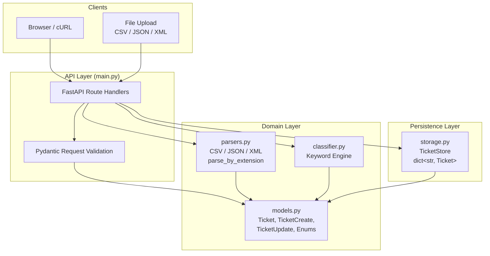
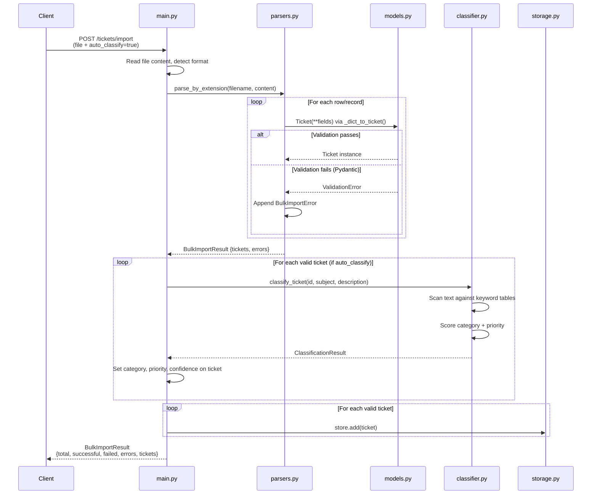
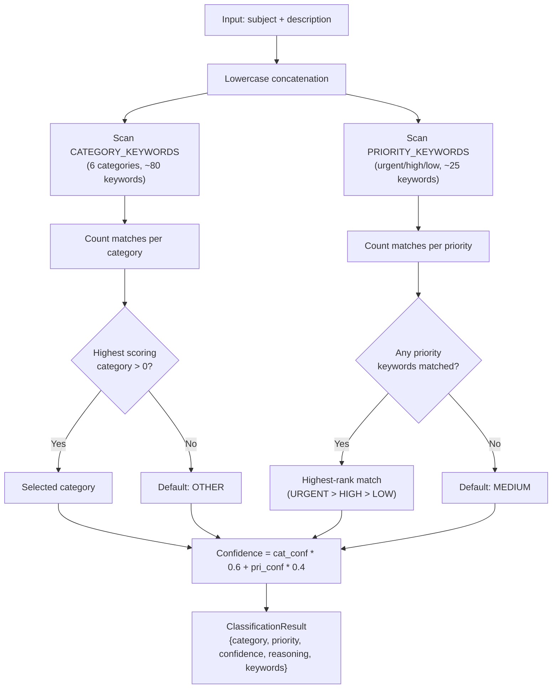

# Architecture

> Refined with Claude Opus 4.6

## Overview

The Intelligent Customer Support System is a REST API built with **Python 3.9 / FastAPI / Pydantic v2**. It manages support tickets through a full CRUD lifecycle, imports tickets from three file formats (CSV, JSON, XML), and automatically classifies them by category and priority using a deterministic keyword-matching engine.

The system follows a layered architecture with clear separation between routing, domain logic, persistence, and parsing.

## Technology Stack

| Layer | Technology | Version |
|-------|-----------|---------|
| Web framework | FastAPI | >= 0.110.0 |
| Data validation | Pydantic v2 + EmailStr | >= 2.0.0 |
| ASGI server | Uvicorn | >= 0.29.0 |
| HTTP client (tests) | httpx + ASGITransport | >= 0.27.0 |
| File upload | python-multipart | >= 0.0.9 |
| Testing | pytest + pytest-cov + pytest-asyncio | >= 8.0.0 |

All parsing uses Python stdlib only (`csv`, `json`, `xml.etree.ElementTree`).

## High-Level Component Diagram



## Data Flow: Ticket Import with Auto-Classification



## Data Flow: Classification Engine



## Component Descriptions

### `src/main.py` -- API Layer

The FastAPI application defines 8 routes (7 business endpoints + `/health`). It acts as the orchestrator: receives HTTP requests, delegates to parsers/classifier/storage, and returns responses. Handles `auto_classify` query parameter on both `POST /tickets` and `POST /tickets/import`.

| Endpoint | Method | Status Codes | Description |
|----------|--------|-------------|-------------|
| `/tickets` | POST | 201, 422 | Create single ticket |
| `/tickets/import` | POST | 200, 422 | Bulk import from file |
| `/tickets` | GET | 200 | List with optional filtering |
| `/tickets/{id}` | GET | 200, 404 | Get by ID |
| `/tickets/{id}` | PUT | 200, 404, 422 | Partial update |
| `/tickets/{id}` | DELETE | 204, 404 | Delete |
| `/tickets/{id}/auto-classify` | POST | 200, 404 | Run classification |
| `/health` | GET | 200 | Health check + ticket count |

### `src/models.py` -- Domain Models

All data structures and enums defined with Pydantic v2 `BaseModel` and `Field` validators:

- **`Ticket`** -- Core entity. UUID ID generated on creation. Field constraints enforced at both API and parser level (`subject` 1-200 chars, `description` 10-2000 chars, `EmailStr` for email).
- **`TicketCreate`** / **`TicketUpdate`** -- Request DTOs. `TicketUpdate` uses `Optional` fields for partial updates.
- **`BulkImportResult`** -- Aggregates import outcomes: `total`, `successful`, `failed`, `errors[]`, `tickets[]`.
- **`ClassificationResult`** -- Classification output: `category`, `priority`, `confidence` (0-1), `reasoning[]`, `keywords_found[]`.
- **Enums**: `Category` (6), `Priority` (4), `Status` (5), `Source` (5), `DeviceType` (3).

### `src/parsers.py` -- Multi-Format Import

Stateless parsing functions that convert raw file content into `BulkImportResult`:

- **`parse_csv(content)`** -- Uses `csv.DictReader`. Validates required columns upfront. Rows are 1-indexed from row 2 (after header).
- **`parse_json(content)`** -- Accepts JSON arrays or objects with `tickets`/`data` keys.
- **`parse_xml(content)`** -- Uses `xml.etree.ElementTree`. Handles nested `<metadata>` and `<tags><tag>` elements.
- **`parse_by_extension(filename, content)`** -- Dispatcher. Falls back to content sniffing (first non-whitespace character: `<` = XML, `[`/`{` = JSON, else CSV).
- **`_dict_to_ticket(record, row)`** -- Shared converter. Handles metadata as JSON string or dict, tags as comma-separated or list.

All parsers catch `ValidationError` per-row and continue processing remaining records.

### `src/classifier.py` -- Keyword Classification Engine

Deterministic, rule-based classifier with no external dependencies:

- **`CATEGORY_KEYWORDS`** -- Dict mapping each `Category` to a list of keyword phrases (~80 total across 5 categories; `OTHER` has no keywords and is the default).
- **`PRIORITY_KEYWORDS`** -- Dict mapping `URGENT`, `HIGH`, `LOW` to keyword phrases (~25 total; `MEDIUM` is the default when no keywords match).
- **`classify(subject, description)`** -- Lowercases input, scans for substring matches, scores by match count. Confidence formula: `(cat_conf * 0.6 + pri_conf * 0.4)` where each component is normalized against the largest keyword list.
- **`classify_ticket(ticket_id, ...)`** -- Wrapper that returns a `ClassificationResult` and logs the decision.

### `src/storage.py` -- In-Memory Persistence

`TicketStore` wraps a `dict[str, Ticket]` with CRUD operations:

- **`add(ticket)`** -- Insert by ID.
- **`get(ticket_id)`** -- Lookup; returns `None` if missing.
- **`update(ticket_id, updates)`** -- Merges update dict, auto-sets `updated_at`. Auto-sets `resolved_at` when status transitions to `RESOLVED` or `CLOSED`.
- **`delete(ticket_id)`** -- Remove by ID; returns `bool`.
- **`list(...)`** -- Filter by `category`, `priority`, `status`, `customer_id` (all optional, composable).
- **`clear()`** -- Wipe all data. Used by test fixtures (`conftest.py` autouse fixture).

A module-level `store = TicketStore()` singleton is shared across the application.

## Design Decisions and Trade-Offs

| Decision | Choice | Alternatives Considered | Rationale |
|----------|--------|------------------------|-----------|
| Storage engine | In-memory `dict` | SQLite, PostgreSQL | No persistence required by spec. Avoids DB setup/migration complexity. Trade-off: data lost on restart, no concurrency guarantees. |
| Classification approach | Keyword substring matching | LLM-based, TF-IDF, regex scoring | Deterministic and fully testable. Zero external dependencies or API keys. Keywords are explicitly listed in TASKS.md spec. Trade-off: no semantic understanding, brittle to paraphrasing. |
| Parser libraries | Python stdlib (`csv`, `json`, `xml.etree`) | `pandas`, `lxml`, `xmltodict` | Minimal dependency footprint. Proven patterns adapted from `Second_session/banking_parser`. Trade-off: less fault-tolerant than `lxml`, no streaming for large files. |
| Validation layer | Pydantic v2 `Field` on `Ticket` model directly | Validate only in `TicketCreate` | Parsers create `Ticket` instances directly (bypassing `TicketCreate`), so constraints must exist on the core model. Discovered via failing test: `test_short_description_row_fails`. |
| ID generation | `uuid.uuid4()` | Auto-increment counter, ULID | Globally unique, no shared state. Avoids race conditions with concurrent imports. Trade-off: not sortable by creation time. |
| Format detection | Extension-based + content sniffing fallback | MIME type detection, magic bytes | Simple and sufficient for the three supported formats. XML starts with `<`, JSON with `[`/`{`, CSV is the default. |
| Confidence formula | `cat_conf * 0.6 + pri_conf * 0.4` | Equal weights, category-only | Category match is more informative than priority match. 60/40 split reflects that category keywords are more distinctive. |

## Project Structure

```
homework-2/
├── src/
│   ├── __init__.py
│   ├── main.py            # FastAPI app + 8 routes
│   ├── models.py           # Pydantic models + enums
│   ├── storage.py          # In-memory TicketStore
│   ├── parsers.py          # CSV / JSON / XML import
│   └── classifier.py       # Keyword classification engine
├── tests/
│   ├── conftest.py         # Shared fixtures, store cleanup
│   ├── test_ticket_api.py  # 12 API endpoint tests
│   ├── test_ticket_model.py# 10 validation tests
│   ├── test_import_csv.py  # 6 CSV import tests
│   ├── test_import_json.py # 5 JSON import tests
│   ├── test_import_xml.py  # 5 XML import tests
│   ├── test_categorization.py # 10 classification tests
│   ├── test_integration.py # 5 end-to-end tests
│   ├── test_performance.py # 5 benchmark tests
│   └── fixtures/           # Sample CSV (50), JSON (20), XML (30)
├── requirements.txt
├── README.md
├── API_REFERENCE.md
├── ARCHITECTURE.md
├── TESTING_GUIDE.md
├── HOWTORUN.md
└── demo/
    ├── run.sh
    ├── sample-requests.sh
    └── sample-requests.http
```

## Security Considerations

| Area | Status | Notes |
|------|--------|-------|
| Authentication | Not implemented | Out of scope for assignment; all endpoints are open |
| Input validation | Enforced | Pydantic validates email format, string lengths, enum values on every request and import row |
| SQL injection | Not applicable | In-memory dict storage; no SQL layer |
| File upload size | Unrestricted | Entire file loaded into memory; not suitable for production without size limits |
| XML external entities (XXE) | Mitigated | `xml.etree.ElementTree` does not expand external entities by default |
| Error disclosure | Controlled | Pydantic validation errors are returned (field-level); no stack traces exposed |

## Performance Characteristics

| Operation | Complexity | Benchmark Result |
|-----------|-----------|-----------------|
| Create ticket | O(1) dict insert | < 1ms |
| Get ticket by ID | O(1) dict lookup | < 1ms |
| List tickets (filtered) | O(n) linear scan | < 5ms for 100 tickets |
| Delete ticket | O(1) dict delete | < 1ms |
| CSV import (50 rows) | O(n) single-pass | < 2s (verified) |
| JSON import (20 records) | O(n) single-pass | < 1s (verified) |
| XML import (30 elements) | O(n) single-pass | < 1s (verified) |
| Classification per ticket | O(k * m), effectively O(1) | < 1ms |
| 20 concurrent requests | Async via httpx.ASGITransport | < 2s (verified) |

**Known limitations:**
- No indexing on filter fields -- linear scan for every `GET /tickets` with filters.
- No pagination -- all matching tickets returned in a single response.
- In-memory storage -- bounded by available RAM; no durability across restarts.

## Test Coverage Summary

58 tests across 8 test files. **92% overall line coverage** (target: >85%).

| Module | Statements | Missed | Coverage |
|--------|-----------|--------|----------|
| `classifier.py` | 52 | 0 | 100% |
| `models.py` | 96 | 0 | 100% |
| `main.py` | 67 | 2 | 97% |
| `storage.py` | 47 | 2 | 96% |
| `parsers.py` | 146 | 30 | 79% |
| **Total** | **408** | **34** | **92%** |

The uncovered lines in `parsers.py` are error-handling branches for edge cases (malformed nested structures, unexpected root element types) that are difficult to trigger through normal test flows.
