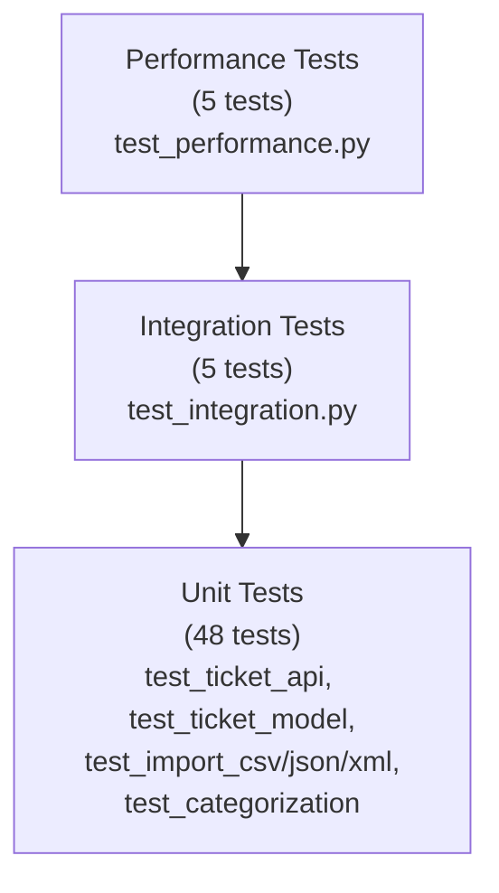

# Testing Guide

> Refined with Claude Opus 4.6

## Test Pyramid



## How to Run Tests

```bash
cd homework-2
source venv/bin/activate

# All tests with coverage
pytest tests/ --cov=src --cov-report=term-missing --cov-report=html

# Single file
pytest tests/test_ticket_api.py -v

# By marker
pytest tests/test_performance.py -v
```

## Test Files

| File | Tests | What it covers |
|------|-------|---------------|
| `test_ticket_api.py` | 12 | CRUD endpoints, filtering, auto_classify flag |
| `test_ticket_model.py` | 10 | Pydantic validation rules, enums, defaults |
| `test_import_csv.py` | 6 | CSV parsing, missing columns, bad rows |
| `test_import_json.py` | 5 | JSON list/object formats, invalid JSON |
| `test_import_xml.py` | 5 | XML parsing, malformed XML, single-ticket root |
| `test_categorization.py` | 10 | Keyword rules, confidence score, edge cases |
| `test_integration.py` | 5 | Full lifecycle, bulk import, concurrency |
| `test_performance.py` | 5 | Import benchmarks, classify benchmark |

**Total: 58 tests**

## Sample Data Locations

| File | Records | Format |
|------|---------|--------|
| `tests/fixtures/sample_tickets.csv` | 50 valid | CSV |
| `tests/fixtures/sample_tickets.json` | 20 valid | JSON (object with `tickets` key) |
| `tests/fixtures/sample_tickets.xml` | 30 valid | XML |
| `tests/fixtures/invalid_tickets.csv` | 5 invalid rows | CSV — bad email, short description, bad enum |
| `tests/fixtures/invalid_tickets.json` | 5 invalid records | JSON — bad email, missing field, invalid category |
| `tests/fixtures/invalid_tickets.xml` | 3 invalid elements | XML — bad email, short description, bad category |

## Manual Testing Checklist

- [ ] `POST /tickets` with valid payload → 201
- [ ] `POST /tickets` with invalid email → 422
- [ ] `POST /tickets?auto_classify=true` with "production down" in subject → `priority: urgent`
- [ ] `POST /tickets/import` with `sample_tickets.csv` → 200, `successful: 50`
- [ ] `POST /tickets/import` with `invalid_tickets.csv` → 200, `failed > 0`, errors array present
- [ ] `GET /tickets?category=billing_question` → only billing tickets
- [ ] `GET /tickets/nonexistent-id` → 404
- [ ] `PUT /tickets/{id}` with `{"status": "resolved"}` → ticket updated
- [ ] `DELETE /tickets/{id}` → 204, subsequent GET → 404
- [ ] `POST /tickets/{id}/auto-classify` → returns ClassificationResult with confidence

## Performance Benchmarks

| Operation | Expected Time | Actual (typical) |
|-----------|-------------|-----------------|
| Import 50 CSV tickets | < 2s | ~0.05s |
| Import 20 JSON tickets | < 1s | ~0.01s |
| Import 30 XML tickets | < 1s | ~0.02s |
| Classify 50 tickets | < 1s | ~0.01s |
| API bulk import 50 tickets | < 3s | ~0.1s |
