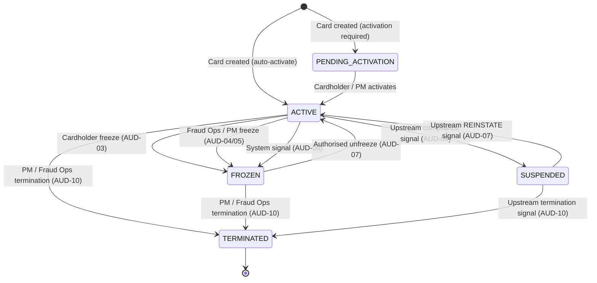
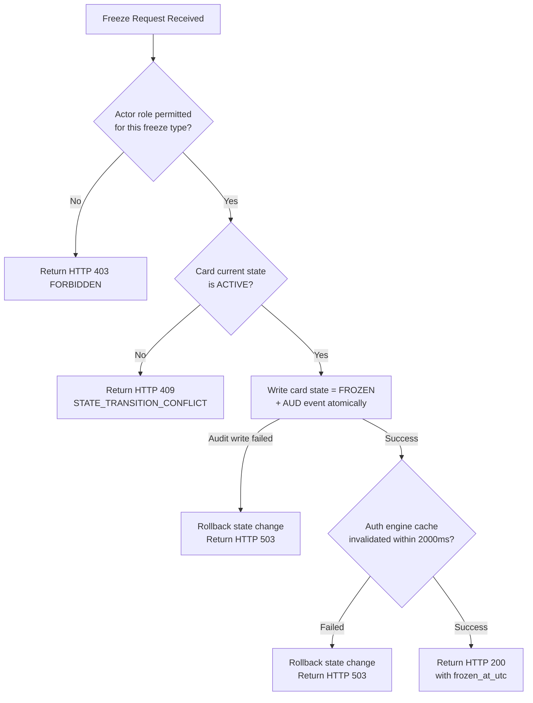
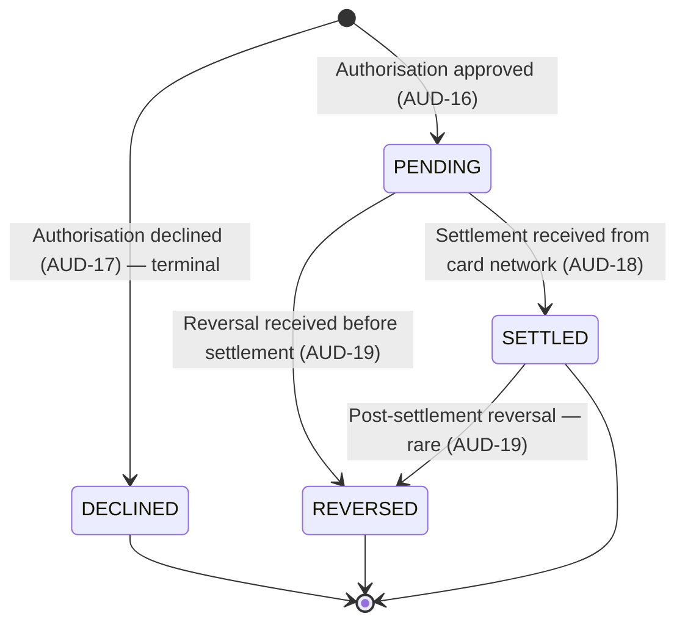
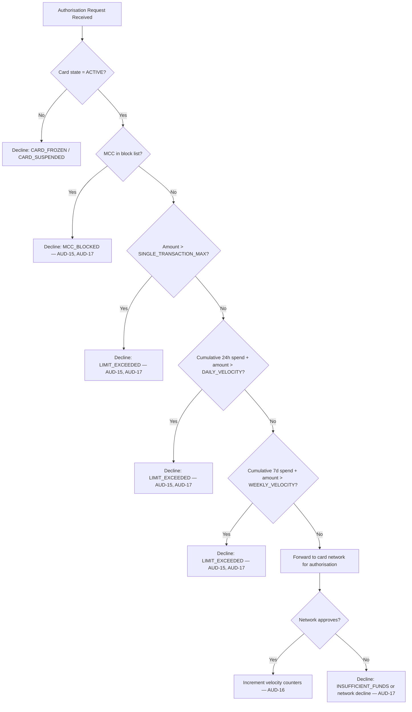

# Virtual Card Lifecycle and Spending Controls — Specification

---

## 1. Document Control

| Field | Value |
|---|---|
| Document ID | SPEC-VCLS-001 |
| Version | 1.0-FINAL |
| Status | FINAL — Phase 6 Hardening Complete |
| Domain | Virtual Card Lifecycle and Spending Controls |
| Classification | Internal — Restricted |
| Regulatory Context | PCI-DSS v4.0, PSD2, GDPR Art. 17/25/30, AMLD |
| Source: Agent 1 | hw3-agent1-phase1-foundation.md (v0.1-FOUNDATION) |
| Source: Agent 2 | hw3-agent2-compliance-overlay.md (v0.1-COMPLIANCE-OVERLAY) |
| Reviewed By | Agent 3 — Specification QA & Rubric Evaluator (Pass 1 + Final Gate) |

---

## 2. Vision and Product Context

### 2.1 Product Purpose

This system enables a regulated financial institution to issue, manage, and control virtual payment cards for individual cardholders within a multi-tenant card programme. It provides cardholder-facing self-service controls, programme-level operational tools for programme managers and fraud operations, and a tamper-evident audit record sufficient for internal compliance review and external regulatory inspection.

Virtual cards are non-physical card credentials — a 16-digit Primary Account Number (PAN), expiry, and CVV — issued against an underlying funding account. All card credentials are tokenized at rest and in transit. The raw PAN is never stored within this system's application layer. The system acts as a Token Requestor, delegating PAN custody to an external PCI-certified vault.

### 2.2 Regulatory Context

| Framework | Applicability | This System's Scope |
|---|---|---|
| PCI-DSS v4.0 | Card credential tokenization, access control | Token Requestor only. Not a CDE. Raw PAN/CVV never stored (COMP-01, COMP-02). |
| PSD2 / Open Banking | Strong Customer Authentication for card issuance and limit changes | SCA outcomes consumed as `sca_verified` token flag. SCA execution is upstream (COMP-04). |
| GDPR Art. 17/25/30 | Data minimisation, right-to-erasure, ROPA | Erasure = pseudonymisation when AMLD retention applies. ROPA is an operational process, not a system feature (COMP-06, COMP-07, COMP-08). |
| EU AMLD (Directive 2015/849) | Record-keeping for financial transactions | 7-year minimum retention for transaction records and audit events (COMP-09). |
| Card Network Rules (Visa/MC) | Authorisation response timing | Decision returned within 200ms; network timeout is 2,000ms (COMP-11). |

> **Disclaimer:** Regulatory mappings in this document are homework assumptions for specification design purposes and do not constitute legal advice.

### 2.3 Boundary Conditions

- **Transaction Visibility:** Real-time authorisation status, 30-day rolling settled transaction history, webhook event delivery. No dispute workflow, no pre-30-day query, no reconciliation feed.
- **Audit Log:** Covers all state-changing operations within this system's five subsystems only. Cross-system correlation is handled by the SIEM layer (out of scope).
- **Spending Limits:** Evaluated at pre-authorisation time only. Post-auth adjustments, refund impact on limits, and credit decisions are out of scope.
- **Fraud Signals:** This system emits fraud signals to the Fraud Intelligence Service. It does not implement fraud scoring or ML inference.

### 2.4 Data Classification Matrix

| Field | Classification | PCI Scope | PII | Storage Rule | Display Rule |
|---|---|---|---|---|---|
| PAN (16-digit) | CRITICAL | Yes — Req 3 | Yes | Never stored. Vault token reference only. | Masked: `**** **** **** {last4}` only. |
| CVV / CVC2 | CRITICAL | Yes — Req 3.2 | No | Never stored post-issuance. Ephemeral only. | Never displayed after issuance response. |
| Card expiry date | SENSITIVE | Yes — Req 3 | Yes | Encrypted at rest (AES-256-GCM). | Authenticated cardholder only. Never in logs. |
| Card token reference | INTERNAL | No | No | Stored freely. Opaque reference. | May appear in logs and audit records. |
| Cardholder ID | SENSITIVE | No | Yes | Stored as UUID. | Never in external API responses. Use token ref. |
| Cardholder name | SENSITIVE | No | Yes | Encrypted at rest. | Authenticated cardholder only. Not in transaction records. |
| Merchant name | BUSINESS | No | No | Plaintext. | Shown in transaction feed. |
| Transaction amount / currency | BUSINESS | No | No | Plaintext. | Shown in transaction feed. |
| Actor IP address | SENSITIVE | No | Yes | Audit log; hashed after 90 days. | FRAUD_OPS and COMPLIANCE_READ roles only. |
| Funding account ID | SENSITIVE | No | Yes | Encrypted reference. | Never in cardholder-facing APIs. |

---

## 3. Stakeholders and Personas

### 3.1 Cardholder (End User)

| Attribute | Detail |
|---|---|
| Goals | Issue virtual cards on demand; control spending; freeze/unfreeze quickly; see transactions in real time. |
| Allowed actions | Create cards against own active funding account; freeze/unfreeze own cards (cardholder-initiated); set/modify spending limits within programme-defined maxima; view own transaction feed; register/deregister webhooks. |
| Forbidden actions | Access another cardholder's cards or transactions; unfreeze a fraud-ops-frozen card; delete audit records; set limits above programme maximum; view raw PAN after issuance. |
| SCA requirement | Required for card creation and spending limit increases above programme threshold (COMP-04). |

### 3.2 Programme Manager (Internal Ops)

| Attribute | Detail |
|---|---|
| Goals | Manage card fleet at programme level; enforce spending policies; bulk-freeze on incident. |
| Allowed actions | Bulk freeze all cards in a programme; export programme-level spending configurations; set programme-level spending limits; terminate cards; view all cards within own programme. |
| Forbidden actions | Access cards outside own programme; view raw PANs; modify audit records; access individual cardholders' private data outside card management context. |
| SCA requirement | Not required for programme operations; separate privilege escalation mechanism applies. |

### 3.3 Fraud Operations Analyst

| Attribute | Detail |
|---|---|
| Goals | Rapidly suspend suspicious cards; investigate fraud patterns; review audit trails. |
| Allowed actions | System-initiated freeze of any card; unfreeze fraud-frozen cards; query audit log; view transaction events including declined attempts with full reason codes. |
| Forbidden actions | Create cards; modify spending limits; export cardholder PII beyond audit context; view raw PANs. |
| Elevated trust | Fraud ops freeze cannot be reversed by cardholder self-service (OBJ-02). |

### 3.4 Operations (Internal Read-Only)

| Attribute | Detail |
|---|---|
| Goals | Monitor system health; investigate operational incidents; review card and transaction state without making changes. |
| Allowed actions | Read card status and state history; read transaction feed for any card; query audit log (read-only); view webhook delivery status. |
| Forbidden actions | Freeze/unfreeze cards; modify limits; initiate erasure requests; view raw PANs; export audit records in bulk. |
| Note | Role: `OPERATIONS_READ`. Distinguished from `COMPLIANCE_READ` — operations role has no compliance hold or erasure capabilities. All audit log reads by this role generate `audit.read` events (COMP-12, AUD-21). |

---

### 3.5 Compliance Officer

| Attribute | Detail |
|---|---|
| Goals | Maintain regulatory audit trail; process GDPR erasure requests; export records for inspections. |
| Allowed actions | Read audit logs (all cards, all programmes); export 90-day audit windows; place compliance holds on records; initiate erasure requests; verify hash chain integrity. |
| Forbidden actions | Modify audit records; delete audit records; create or freeze cards; view raw PANs. |
| Note | All audit log reads by this role generate `audit.read` events (COMP-12, AUD-21). |

### 3.6 Support Agent

| Attribute | Detail |
|---|---|
| Goals | Diagnose and explain card status to cardholders; escalate to fraud ops or compliance. |
| Allowed actions | Read card status and masked card details for a specific cardholder (with cardholder consent context); view non-sensitive transaction status; view non-sensitive decline reason codes. |
| Forbidden actions | Freeze/unfreeze cards; modify limits; view full audit log; view raw PANs or CVVs; initiate erasure requests. |
| Principle | Support role follows minimum necessary data access. Cannot perform any state-changing operations. |

---

## 4. Scope and Out-of-Scope

### 4.1 In-Scope Subsystems

| ID | Subsystem | Description |
|---|---|---|
| SYS-01 | Virtual Card Creation | Issuance of tokenized card credentials against a validated funding account. |
| SYS-02 | Card Freeze and Unfreeze | Cardholder and system-initiated suspension and reinstatement of card authorisation. |
| SYS-03 | Spending Controls | Per-card rules for transaction amount, velocity, and MCC allow/block. |
| SYS-04 | Transaction Visibility | Real-time auth status, 30-day history, webhook event delivery. |
| SYS-05 | Audit and Compliance Operations | Append-only event log, role-gated access, retention policy, erasure handling. |

### 4.2 Explicit Out-of-Scope

| Excluded Area | Rationale | Responsible System |
|---|---|---|
| Dispute and chargeback processing | Separate regulated workflow | Disputes Platform |
| Settlement and reconciliation | Downstream of authorisation | Payments Ledger |
| SOC 2 Type II reporting pipeline | Organisational-level reporting | Security & Compliance Platform |
| Full AML / KYC platform | Cardholder onboarding and ongoing diligence | Identity and Compliance Platform |
| Physical card issuance | Different fulfilment workflow | Card Fulfilment Service |
| Foreign exchange / currency conversion | FX rate management | Treasury / FX Service |
| Instalment and credit features | Requires credit permissions | Credit Platform |
| Push-to-card / money movement | Upstream of card issuance | Payments Platform |
| Fraud scoring and ML model inference | Signals consumed, not produced here | Fraud Intelligence Service |
| Transaction history beyond 30 days | Long-term archival | Data Platform |
| SCA / MFA implementation | SCA outcomes consumed; execution is upstream | Authentication Service |

---

## 5. High-Level Objective

> **HLO-01:** Provide a regulated, auditable, and cardholder-controlled virtual card management system that enables real-time card issuance, suspension, and spending governance, while maintaining a tamper-evident compliance record sufficient for PCI-DSS and GDPR regulatory inspection — with card freeze operations completing end-to-end within 2 seconds (p99) and authorisation decisions completing within 200ms (p99).

---

## 6. Mid-Level Objectives

### OBJ-01 — Virtual Card Issuance

**Description:** A cardholder with a validated, active funding account can request and receive a tokenized virtual card credential within 3 seconds (p99), immediately usable for authorised transactions.

**Success Criteria:**
- `POST /cards` returns a tokenized card reference (not raw PAN) within 3,000ms at p99 under ≤ 500 concurrent requests.
- Issued card enters `ACTIVE` state immediately on successful creation.
- A `card.created` audit event (AUD-01) is written within 500ms of credential issuance.
- Duplicate requests with the same idempotency key return the original response; no second card record is created.
- Card creation is rejected HTTP 422 if funding account status is not `ACTIVE`.
- CVV is returned exactly once in the issuance response body with `Cache-Control: no-store` (SEC-04).
- PAN Vault unreachable after 2 retries → HTTP 503 with `Retry-After: 5`. No partial card record persisted (NFR-16).
- Missing or false `sca_verified` flag → HTTP 403 `SCA_REQUIRED` (COMP-04).

**Primary Stakeholder:** Cardholder

**Related Subsystems:** SYS-01, SYS-05

**Verification:** Load test (p99 latency); integration test (idempotency, CVV ephemeral delivery, SCA gate); log scan (no raw PAN in logs).

**Traceability:** OBJ-01 → REQ-01.01–01.09 → TASK-01.01–01.09

---

### OBJ-02 — Card Freeze and Unfreeze

**Description:** A cardholder or authorised system actor (fraud ops, programme manager) can suspend a card's authorisation capability within 2 seconds end-to-end (p99). All subsequent authorisations are declined for the freeze duration. Distinct audit trails are maintained for cardholder-initiated versus system-initiated freezes.

**Success Criteria:**
- `POST /cards/{id}/freeze` completes and propagates to the auth engine within 2,000ms at p99.
- Any authorisation received ≥ 500ms after freeze confirmation is declined with `CARD_FROZEN`.
- Cardholder-initiated and system-initiated freeze events are distinct audit event types (AUD-03 vs AUD-04/AUD-06).
- A fraud-ops-frozen card cannot be unfrozen by the cardholder (AUD-08 generated on attempt).
- Unfreeze returns card to `ACTIVE`; `card.unfrozen` (AUD-07) written within 500ms.
- Concurrent freeze requests → exactly one succeeds; other returns HTTP 409 (FAIL-02).

**Primary Stakeholder:** Cardholder, Fraud Operations

**Related Subsystems:** SYS-02, SYS-05

**Verification:** End-to-end propagation timing test; concurrent freeze test (100 pairs); role permission test (cardholder cannot unfreeze fraud-frozen card).

**Traceability:** OBJ-02 → REQ-02.01–02.08 → TASK-02.01–02.05

---

### OBJ-03 — Spending Controls Enforcement

**Description:** Programme managers and cardholders (within programme-defined permission boundaries) can configure per-card spending rules — single-transaction limits, daily/weekly velocity limits, MCC allow/block lists — enforced atomically at authorisation time without adding more than 50ms (p99) to the authorisation latency.

**Success Criteria:**
- Authorisations exceeding a single-transaction limit are declined with `LIMIT_EXCEEDED` before reaching the card network.
- Velocity counters use a 24-hour sliding window anchored to UTC (not calendar-day reset).
- MCC block rules decline transactions with `MCC_BLOCKED` within the same latency budget.
- Spending limit changes take effect for authorisations received ≥ 200ms after the successful limit-update API response.
- Spending limit evaluation adds ≤ 50ms at p99 (NFR-03).
- Limit set to zero blocks all transactions (not treated as "no limit").
- Every spending control modification generates `limit.created/updated/deleted` audit event (AUD-12–14).
- SCA required for limit increases above programme-configured threshold (COMP-05).

**Primary Stakeholder:** Cardholder, Programme Manager

**Related Subsystems:** SYS-03, SYS-05

**Verification:** Latency benchmark of limit evaluation in isolation; concurrent velocity counter test; limit-zero test; MCC block test; sliding window vs. calendar-day boundary test.

**Traceability:** OBJ-03 → REQ-03.01–03.10 → TASK-03.01–03.05

---

### OBJ-04 — Real-Time Transaction Visibility

**Description:** A cardholder can retrieve the real-time authorisation status of any card transaction and query a 30-day rolling settled transaction history via API, with webhook events delivered within 10 seconds (p95) of the triggering event.

**Success Criteria:**
- `GET /cards/{id}/transactions` returns settled transactions within the trailing 30-day window in ≤ 1,000ms at p95.
- Each record includes: transaction ID, merchant name, MCC, amount, currency, auth timestamp, settlement timestamp (if settled), and status (`PENDING` / `SETTLED` / `DECLINED` / `REVERSED`).
- Declined attempts are visible with status `DECLINED` and a non-sensitive decline reason code.
- Webhook events for `transaction.authorised`, `transaction.settled`, `transaction.declined`, `transaction.reversed` are delivered within 10,000ms at p95.
- Webhook payloads are HMAC-SHA256 signed; payloads older than 300 seconds are rejected by consumers (SEC-07).
- At least 3 retry attempts with exponential backoff (10s, 60s, 300s) before `webhook.delivery_failed` (NFR-15).
- Webhook URLs must use HTTPS; private/internal IP ranges are rejected (SEC-12).

**Primary Stakeholder:** Cardholder

**Related Subsystems:** SYS-04, SYS-05

**Verification:** p95 latency test with 10,000+ transactions per card; webhook delivery timing test; signed-payload replay test (>300s rejected); dead-letter queue test after 3 failures.

**Traceability:** OBJ-04 → REQ-04.01–04.07 → TASK-04.01–04.05

---

### OBJ-05 — Immutable Audit Log

**Description:** Every state-changing operation generates an append-only, tamper-evident audit event readable by authorised roles within 1 second of write, retained for 7 years minimum, and exportable in machine-readable format within 60 seconds for any 90-day query window.

**Success Criteria:**
- Audit events are append-only; no UPDATE or DELETE exists on compliance-classified events (AUD-RET-05).
- Every audit event contains all 17 mandatory fields defined in §7.2 (AUD event schema).
- Read access by compliance/operations roles generates `audit.read` events (COMP-12, AUD-21).
- Export of a 90-day window for a single card completes within 60 seconds; returns valid JSON Lines or CSV.
- Records under compliance hold are exempt from GDPR erasure for the hold duration (COMP-06).
- Tamper evidence via hash chaining (AUD-RET-03); 10,000-event chain verifiable within 10 seconds.
- Audit log availability ≥ 99.9% monthly (NFR-07).
- GDPR erasure → pseudonymisation of PII fields, not record deletion (COMP-09).

**Primary Stakeholder:** Compliance Officer, External Auditor

**Related Subsystems:** SYS-05

**Verification:** Append-only enforcement test (attempt UPDATE → rejected); export latency test; hash chain integrity verification; erasure-pseudonymisation test.

**Traceability:** OBJ-05 → REQ-05.01–05.08 → TASK-05.01–05.05

---

### OBJ-06 — Card Lifecycle State Integrity

**Description:** The card lifecycle state machine enforces valid transitions only, with every transition recorded atomically with its audit event. No card exists in an undefined or unrecoverable state. Concurrent state-change operations on the same card are serialised with deterministic, auditable outcomes.

**Success Criteria:**
- Exactly 5 states defined: `PENDING_ACTIVATION`, `ACTIVE`, `FROZEN`, `SUSPENDED`, `TERMINATED`.
- Invalid transition attempts return HTTP 409 with a machine-readable error code (AUD-11 written).
- Concurrent state-change requests → exactly one succeeds; other returns HTTP 409 (FAIL-02).
- State and audit event written in the same atomic transaction; if audit write fails, state change is rolled back (FAIL-04).
- `TERMINATED` is an irrecoverable terminal state; no transition out of it is permitted.
- `FROZEN` and `SUSPENDED` have distinct semantic definitions (§9.2.1): FROZEN is user/ops-reversible; SUSPENDED requires upstream compliance clearance.

**Primary Stakeholder:** All internal stakeholders, Card Network

**Related Subsystems:** SYS-01, SYS-02, SYS-05

**Verification:** Full state transition table test (all valid + all invalid transitions); atomicity test (audit store failure → state rolled back); concurrent transition test (100 pairs, 100% deterministic outcome).

**Traceability:** OBJ-06 → REQ-06.01–06.04 → TASK-01.07, TASK-02.03, TASK-02.05

**Functional Requirements (State Integrity):**

| ID | Requirement |
|---|---|
| REQ-06.01 | The card lifecycle state machine must define exactly 5 states with exhaustive enumeration of valid transitions, guard conditions, and audit events per transition (§10.1). |
| REQ-06.02 | All invalid state transition attempts must return HTTP 409 with a machine-readable error code and write AUD-11 to the audit log. |
| REQ-06.03 | Concurrent state-change requests on the same card must be serialised using optimistic locking (VirtualCard.version field). Exactly one request succeeds; others return HTTP 409. |
| REQ-06.04 | Card state and its corresponding audit event must be written in a single atomic database transaction. If the audit write fails, the state change is rolled back. |

---

### OBJ-07 — Programme-Level Operations

**Description:** Authorised programme managers can perform fleet-level operations including bulk freeze of all cards within a programme, with bulk freeze of ≤ 10,000 cards completing within 30 seconds, and individual card API SLAs maintained throughout the bulk operation.

**Success Criteria:**
- `POST /programs/{id}/freeze-all` returns a job ID immediately (async). Job reaches terminal state within 30 seconds for ≤ 10,000 cards.
- Partial failures reported per-card in job result; successfully frozen cards not rolled back on partial failure (FAIL-07).
- Individual card APIs maintain p99 latency SLAs during bulk operations (NFR-14 scope).
- Programme manager actions recorded in audit log with role `PROGRAM_MANAGER` and programme ID as context field (AUD-24, AUD-25).

**Primary Stakeholder:** Programme Manager

**Related Subsystems:** SYS-01, SYS-02, SYS-03, SYS-05

**Verification:** Bulk freeze test (10,000 cards, ≤ 30s); partial failure test (10% TERMINATED cards in batch); individual API latency test during concurrent bulk freeze.

**Traceability:** OBJ-07 → REQ-07.01–07.04 → TASK-07.01–07.05

**Functional Requirements (Programme Operations):**

| ID | Requirement |
|---|---|
| REQ-07.01 | `POST /v1/programs/{id}/freeze-all` must return a job ID (HTTP 202) immediately and execute the freeze asynchronously. |
| REQ-07.02 | The bulk freeze job must reach a terminal state (`COMPLETED` or `PARTIAL_FAILURE`) within 30 seconds for a programme of ≤ 10,000 cards. |
| REQ-07.03 | Partial failures in bulk freeze are recorded per-card in the job result. Successfully frozen cards are not rolled back if other cards in the batch fail. |
| REQ-07.04 | Individual card API endpoints must maintain p99 latency SLAs during concurrent bulk freeze operations (resource isolation required). |


---

## 7. Regulatory, Security, and Compliance Assumptions

### 7.1 Compliance Assumptions

> Labels: **Hard Req** = non-negotiable for any regulated FinTech deployment. **Assumption** = reasonable homework-scoped interpretation; not legal advice.

| ID | Framework | Type | Requirement / Assumption |
|---|---|---|---|
| COMP-01 | PCI-DSS v4.0 | Hard Req | This system never stores, processes, or transmits raw PANs. All PAN operations are delegated to an external PCI-certified vault. The system stores and operates on opaque token references only. |
| COMP-02 | PCI-DSS v4.0 | Hard Req | CVV/CVC2 values are never stored post-issuance — not in logs, not in audit records, not in any persistent store. CVV is generated by the vault and delivered to the cardholder in a single ephemeral response. |
| COMP-03 | PCI-DSS v4.0 | Hard Req | All API communication between this system and the PAN Vault uses mutual TLS (mTLS). All cardholder-facing endpoints use TLS 1.2+ with no fallback to insecure protocols. |
| COMP-04 | PSD2 / SCA | Assumption | SCA is required for: (a) card issuance, (b) spending limit increase above programme-defined threshold, (c) unfreeze of a fraud-frozen card. This system verifies `sca_verified: true` on the inbound auth token. Absent or false → HTTP 403 `SCA_REQUIRED`. |
| COMP-05 | PSD2 / SCA | Assumption | SCA threshold for spending limit modification is configurable per programme (default: any single-transaction limit increase). Decreasing a limit does not trigger SCA. |
| COMP-06 | GDPR Art. 17 | Hard Req | Right-to-erasure requests must be processed within 30 calendar days. Erasure cannot be applied to records under a legal/regulatory hold or within the mandatory 7-year retention period. |
| COMP-07 | GDPR Art. 25 | Hard Req | Data minimisation: only PII strictly necessary for the operation is collected. Transaction records must not store the full cardholder name — a pseudonymised identifier suffices for the transaction feed. |
| COMP-08 | GDPR Art. 30 | Assumption | This system maintains a ROPA entry documenting data subjects, personal data categories, retention periods, and recipients. ROPA maintenance is an operational process, not a system feature. |
| COMP-09 | AMLD / Financial Regs | Assumption | Transaction records and audit events are retained for a minimum of 7 years per EU AMLD record-keeping requirements. When GDPR erasure conflicts with this obligation, PII fields are pseudonymised (not deleted) to satisfy both frameworks simultaneously. |
| COMP-10 | Financial Regs | Assumption | This system does not perform AML/KYC checks. It relies on the upstream Identity and Compliance Platform to have completed diligence before a cardholder account reaches `ACTIVE` status. Revocation of cardholder verification triggers a `SUSPEND` signal to SYS-02. |
| COMP-11 | Card Network Rules | Assumption | Authorisation responses must be returned to the card network within 2,000ms. This system targets 200ms to leave headroom for network routing. |
| COMP-12 | Operational | Hard Req | All access to audit logs, card state, and cardholder PII must be logged — including read access by compliance officers and auditors. "Who looked at what and when" is itself an auditable event (AUD-21). |

### 7.2 Audit Event Schema (Mandatory Fields)

Every audit event written by any subsystem must contain all 17 fields below. Missing fields must be `null`, never absent.

| Field | Type | Description |
|---|---|---|
| `event_id` | UUID v7 | Globally unique, time-ordered event identifier |
| `event_type` | Enum string | From the Auditable Event Registry (§7.3) |
| `timestamp_utc` | ISO 8601 with ms | Event creation time in UTC |
| `actor_id` | UUID | Identity of human or system actor who caused the event |
| `actor_role` | Enum string | Role of actor at time of event |
| `actor_ip_hash` | SHA-256 string | Hashed IP of actor (raw IP stored only for 90 days) |
| `resource_type` | Enum string | `CARD`, `SPENDING_LIMIT`, `WEBHOOK`, `AUDIT_LOG`, `PROGRAMME` |
| `resource_id` | UUID | ID of the affected resource |
| `program_id` | UUID | Card programme context |
| `before_state` | JSON object | Resource state before the operation; `null` for creation events |
| `after_state` | JSON object | Resource state after the operation; `null` for failed operations |
| `correlation_id` | UUID | Request-level correlation ID for distributed tracing |
| `idempotency_key` | String / null | Idempotency key of the triggering request if present |
| `metadata` | JSON object | Event-type-specific additional data |
| `schema_version` | Semver string | Audit event schema version (current: `1.0.0`) |
| `sequence_number` | Monotonic int | Per-resource sequence number for gap detection |
| `integrity_hash` | SHA-256 string | `SHA-256(previous_event.integrity_hash + canonical_json(current_event))` |

### 7.3 Auditable Event Registry

| ID | Event Type | Trigger | Subsystem | Severity |
|---|---|---|---|---|
| AUD-01 | `card.created` | Successful card issuance | SYS-01 | INFO |
| AUD-02 | `card.creation_failed` | Card issuance rejected | SYS-01 | WARN |
| AUD-03 | `card.frozen.cardholder` | Cardholder initiates freeze | SYS-02 | INFO |
| AUD-04 | `card.frozen.fraud_ops` | Fraud operations initiates freeze | SYS-02 | ALERT |
| AUD-05 | `card.frozen.program_manager` | Programme manager initiates freeze | SYS-02 | INFO |
| AUD-06 | `card.frozen.system` | Automated fraud signal triggers freeze | SYS-02 | ALERT |
| AUD-07 | `card.unfrozen` | Card unfrozen by authorised actor | SYS-02 | INFO |
| AUD-08 | `card.unfreeze_denied` | Unfreeze attempted by unauthorised actor | SYS-02 | WARN |
| AUD-09 | `card.suspended` | Card suspended due to upstream compliance signal | SYS-02 | ALERT |
| AUD-10 | `card.terminated` | Card permanently terminated | SYS-02 | INFO |
| AUD-11 | `card.transition_rejected` | Invalid state transition attempted | SYS-02/06 | WARN |
| AUD-12 | `limit.created` | Spending limit created | SYS-03 | INFO |
| AUD-13 | `limit.updated` | Spending limit modified | SYS-03 | INFO |
| AUD-14 | `limit.deleted` | Spending limit removed | SYS-03 | INFO |
| AUD-15 | `limit.breached` | Transaction declined due to spending limit | SYS-03 | INFO |
| AUD-16 | `transaction.authorised` | Transaction approved at authorisation time | SYS-04 | INFO |
| AUD-17 | `transaction.declined` | Transaction declined (any reason) | SYS-04 | INFO |
| AUD-18 | `transaction.settled` | Transaction settled | SYS-04 | INFO |
| AUD-19 | `transaction.reversed` | Transaction reversed | SYS-04 | INFO |
| AUD-20 | `audit.exported` | Compliance officer exports audit records | SYS-05 | INFO |
| AUD-21 | `audit.read` | Any actor reads audit log records | SYS-05 | INFO |
| AUD-22 | `webhook.registered` | Cardholder registers webhook endpoint | SYS-04 | INFO |
| AUD-23 | `webhook.delivery_failed` | All retry attempts exhausted | SYS-04 | WARN |
| AUD-24 | `bulk_freeze.initiated` | Programme manager initiates bulk freeze | SYS-07 | ALERT |
| AUD-25 | `bulk_freeze.completed` | Bulk freeze job reaches terminal state | SYS-07 | INFO |
| AUD-26 | `erasure.requested` | GDPR right-to-erasure request received | SYS-05 | ALERT |
| AUD-27 | `erasure.executed` | PII pseudonymised in compliance with request | SYS-05 | ALERT |
| AUD-28 | `erasure.denied` | Erasure blocked by compliance hold or retention | SYS-05 | ALERT |
| AUD-29 | `card.activated` | Card transitions from PENDING_ACTIVATION to ACTIVE | SYS-01 / SYS-02 | INFO |

### 7.4 Security Requirements

| ID | Requirement | Acceptance Criterion |
|---|---|---|
| SEC-01 | All external endpoints enforce TLS 1.2+ (AES-GCM, ChaCha20-Poly1305). TLS 1.0/1.1 rejected. | Automated TLS scan reports zero connections accepted below TLS 1.2. |
| SEC-02 | PAN Vault communication uses mTLS with certificate pinning. Certs rotate every 90 days with zero downtime. | Cert rotation test passes with zero dropped requests. |
| SEC-03 | Raw PAN never appears in logs, error messages, API responses (except masked last-4 at issuance), audit events, metric labels, or tracing spans. | Log scan regex `\b\d{13,19}\b` returns zero matches after full integration test run. |
| SEC-04 | CVV returned exactly once in issuance response body with `Cache-Control: no-store`. CVV absent from all subsequent responses and all logs. | Integration test: CVV in issuance response; absent from GET /cards/{id}; absent from all log files. |
| SEC-05 | Auth tokens: cardholder session max 15 min; service-to-service max 60 min. Refresh token rotation enforced. | Token accepted at minute 14 → HTTP 200. Token at minute 16 → HTTP 401. |
| SEC-06 | RBAC enforced on every endpoint before business logic executes. Permission matrix is configuration, not hardcoded. | CARDHOLDER token on COMPLIANCE_READ endpoint → HTTP 403 in 100% of tests. |
| SEC-07 | Webhook payloads signed HMAC-SHA256 with per-endpoint shared secret. Payloads older than 300s rejected (replay protection). | Replay test: valid payload after 301s → consumer rejects. |
| SEC-08 | PII fields encrypted at rest using AES-256-GCM with envelope encryption. Keys in secrets vault. Key rotation every 365 days without re-encrypting existing records. | Key rotation test: old records still readable; new writes use new key version. |
| SEC-09 | Failed auth attempts rate-limited: 5 per 60s per source IP. After 5th failure, HTTP 429 for 300s. | 6th failure in 60s → HTTP 429. Request at second 301 → normal response. |
| SEC-10 | Resources belonging to another cardholder return HTTP 403, not HTTP 404. Non-existent resources return HTTP 404. | CARDHOLDER A on CARDHOLDER B's card → HTTP 403. Non-existent card ID → HTTP 404. |
| SEC-11 | All DB queries use parameterised queries or ORM query builders. No string concatenation for SQL. | Static analysis (Semgrep) reports zero SQL injection findings. |
| SEC-12 | Webhook registration validates HTTPS scheme and blocks private/internal IP ranges (SSRF protection). | `http://` URL → HTTP 422. `https://169.254.169.254/` → HTTP 422. |

### 7.5 Retention and Tamper-Evidence Rules

| ID | Rule |
|---|---|
| AUD-RET-01 | Minimum 7-year retention from event creation date (AMLD alignment). |
| AUD-RET-02 | Records under active compliance hold are exempt from automated deletion, regardless of age. |
| AUD-RET-03 | Hash chaining: `integrity_hash = SHA-256(prev.integrity_hash + canonical_json(current))`. Genesis event uses a well-known programme-specific seed. |
| AUD-RET-04 | Offline hash chain verification tool must complete 10,000-event chain check within 10 seconds. |
| AUD-RET-05 | Audit store must reject any UPDATE or DELETE on compliance-classified events at the storage layer (write-once policy or DB trigger). |
| AUD-RET-06 | Daily gap-detection job runs per-resource sequence number analysis; alerts on any detected gap within 5 minutes of job completion. |

---

## 8. Non-Functional Requirements

| ID | Category | Target | Rationale | Verification Method |
|---|---|---|---|---|
| NFR-01 | Latency — card creation | `POST /cards` p99 ≤ 3,000ms at ≤ 500 concurrent requests | Issuer processor SLA + vault tokenization round-trip | Load test (k6/Locust); percentile assertion on histogram |
| NFR-02 | Latency — freeze propagation | Freeze end-to-end (API + auth engine) p99 ≤ 2,000ms | Fraud response window | Freeze card → attempt auth → measure decline timing |
| NFR-03 | Latency — auth / limit evaluation | Spending limit evaluation adds ≤ 50ms p99 to auth path | Card network 2,000ms timeout budget | Isolated benchmark of limit evaluation; flame graph analysis |
| NFR-04 | Latency — transaction feed | `GET /cards/{id}/transactions` p95 ≤ 1,000ms for 30-day window | UX threshold | Load test against ≥ 10,000 transactions per card |
| NFR-05 | Latency — audit export | 90-day export for single card ≤ 60 seconds | Compliance officer workflow tolerance | Integration test with pre-seeded 90-day data |
| NFR-06 | Availability — auth path | ≥ 99.95% monthly (≤ 21.9 min downtime/month) | Card network contractual availability | 30-second health check intervals; monthly SLO report |
| NFR-07 | Availability — audit read | ≥ 99.9% monthly (≤ 43.2 min downtime/month) | Less critical than auth path | Same monitoring infrastructure; separate SLO target |
| NFR-08 | Availability — webhook delivery | ≥ 99.5% of events delivered within 60s (including retries) | Best-effort; dead-letter captures remainder | 30-day rolling delivery success rate metric |
| NFR-09 | Consistency — card state | Strong read-after-write consistency for single-card reads. Eventual consistency for list/search (max staleness: 2 seconds). | Freeze must be immediately visible to auth engine | Write freeze → immediate read → assert FROZEN; 1,000 iterations, 100% pass rate |
| NFR-10 | Consistency — velocity counters | Accurate to within 1 transaction of true count at evaluation time. No double-counting of the same authorisation. | Under-counting enables limit bypass | 100 parallel auths against limit-50 → between 49–51 approved |
| NFR-11 | Idempotency | All mutating endpoints accept `Idempotency-Key` header. Duplicate requests within 24h return the original response with the **original HTTP status code** (e.g., 201 for creates, 200 for updates/actions). The response includes `Idempotency-Key` and `Idempotent-Replayed: true` headers to signal reuse. Body mismatch (same key, different payload) returns HTTP 422 `IDEMPOTENCY_KEY_CONFLICT`. | Retry storm protection | Send same request 3× with same key → identical responses including identical status code; 1 DB record. |
| NFR-12 | Rate limiting — cardholder APIs | ≤ 60 req/min per cardholder; burst: 10 req/1s. Exceeded → HTTP 429 + `Retry-After`. | Abuse prevention | 61st request in 60s → HTTP 429 with Retry-After |
| NFR-13 | Rate limiting — card creation | Per-cardholder: ≤ 5 creations/24h. Per-programme: ≤ 1,000/hour. Exceeded → HTTP 429 `CARD_CREATION_RATE_EXCEEDED`. | Card enumeration prevention | 6th creation in 24h → HTTP 429 |
| NFR-14 | Rate limiting — auth path | No rate limit on auth decision path (card network–facing). | Declining legitimate transactions worse than absorbing load | Documented design decision; load test confirms ≥ 2,000 auth req/s without rate-limit rejection |
| NFR-15 | Retry — webhook | 3 retries: 10s, 60s, 300s backoff. After 3 failures → dead-letter queue. | Delivery reliability without infinite loops | Mock endpoint returning HTTP 500 × 3 → event in dead-letter; no 4th attempt |
| NFR-16 | Retry — vault tokenization | 2 retries with 500ms backoff. After 2 failures → HTTP 503 `Retry-After: 5`. No partial card created. | Vault transient failures should not block issuance permanently | Mock vault HTTP 503 × 2 then 200 → card created. HTTP 503 × 3 → HTTP 503 to caller |
| NFR-17 | Data retention — transactions | Retained 7 years. Records older than 30 days move to cold storage (not queryable via feed API; accessible via audit export). | AMLD + GDPR | Day-31 record absent from feed; present in audit export |
| NFR-18 | Data retention — audit events | Retained 7 years minimum; compliance hold extends indefinitely. | AMLD record-keeping | Year-7+1-day event without hold → deleted. With hold → retained. |
| NFR-19 | Observability — metrics | Every subsystem emits request count, error count (by HTTP status), latency histogram (p50/p95/p99) as Prometheus-compatible metrics; scrape interval ≤ 15s. | Operational SLO monitoring | Prometheus scrape returns all required metric names with valid values |
| NFR-20 | Observability — tracing | Every API request generates a distributed trace with `trace_id` propagated to vault, event bus, audit store. Traces retained 7 days. | Incident investigation | API call → retrieve trace by `correlation_id` → spans include all downstream calls |
| NFR-21 | Observability — alerting | Alerts fire within 120s of: (a) auth path p99 > 200ms for 5 min, (b) audit write failure rate > 0.1% for 5 min, (c) bulk freeze job exceeds 30s deadline. | Incident response SLA | Inject fault → alert fires ≤ 120s; remove fault → alert resolves ≤ 120s |

---

## 9. Subsystem Specifications

### 9.1 Virtual Card Creation (SYS-01)

**Purpose:** Issue tokenized virtual card credentials to authenticated cardholders with validated, active funding accounts.

**In-scope behaviour:**
- Accept card creation request with funding account reference and programme ID.
- Validate funding account status via upstream check (must be `ACTIVE`).
- Request tokenized PAN + CVV from PAN Vault via mTLS.
- Persist card record with token reference (not raw PAN) and initial state `ACTIVE`.
- Return tokenized card reference and ephemeral CVV to cardholder in single response.
- Write `card.created` audit event atomically with card record creation.

**Out-of-scope:** Physical card issuance, FX conversion, credit decisioning, AML/KYC checks.

**Functional Requirements:**

| ID | Requirement |
|---|---|
| REQ-01.01 | System must validate that funding account status is `ACTIVE` before initiating vault tokenization. |
| REQ-01.02 | System must delegate PAN generation and CVV generation entirely to the external PAN Vault. |
| REQ-01.03 | CVV must be returned to the cardholder in the response body exactly once; it must not be stored in any system data store. |
| REQ-01.04 | API response must include `Cache-Control: no-store` when CVV is present. |
| REQ-01.05 | Idempotency-Key must be accepted; duplicate requests within 24h return original response without creating a second card. |
| REQ-01.06 | Card creation is rejected with HTTP 403 if `sca_verified: true` is absent from the authentication token. |
| REQ-01.07 | Card creation is rate-limited: ≤ 5 per cardholder per 24h; ≤ 1,000 per programme per hour. |
| REQ-01.08 | `card.created` (AUD-01) must be written within 500ms of credential issuance, atomically with the card record. |
| REQ-01.09 | On PAN Vault failure after 2 retries, return HTTP 503 with `Retry-After: 5`; no partial card record is persisted. |

**Permissions:**

| Role | Allowed | Denied |
|---|---|---|
| CARDHOLDER | Create card against own funding account | Create card for another cardholder |
| PROGRAM_MANAGER | Create cards in bulk for own programme | Create cards outside own programme |
| FRAUD_OPS | None | Card creation |
| COMPLIANCE_READ | None | Card creation |

**Audit Events:** AUD-01 (`card.created`), AUD-02 (`card.creation_failed`)

**Security Rules:** SEC-03 (no raw PAN in logs), SEC-04 (CVV ephemeral), SEC-06 (RBAC), COMP-01, COMP-02

**Edge Cases:** EDGE-01 (duplicate create), EDGE-02 (vault timeout), EDGE-03 (funding account inactive at request time), EDGE-04 (idempotency key conflict), EDGE-05 (rate limit breach)

**Verification:** Integration test covering all REQ-01.01–01.09; log scan (no PAN); CVV absent from GET response; SCA gate test.

---

### 9.2 Card Freeze and Unfreeze (SYS-02)

**Purpose:** Allow cardholder and authorised system actors to suspend and reinstate a card's authorisation capability, with distinct audit trails per actor type.

#### 9.2.1 State Semantic Distinction: FROZEN vs. SUSPENDED

| Attribute | FROZEN | SUSPENDED |
|---|---|---|
| Initiated by | Cardholder, Fraud Ops, Programme Manager, or automated fraud signal | Upstream compliance/KYC platform only |
| Meaning | Temporary authorisation hold. Card credentials remain valid. | Regulatory or compliance-driven hold. Card may not be reactivated without upstream clearance. |
| Unfreeze path | Cardholder (if self-frozen); Fraud Ops (if fraud-frozen); Programme Manager | Upstream compliance platform sends `REINSTATE` signal only. No self-service unfreeze. |
| Transaction decline code | `CARD_FROZEN` | `CARD_SUSPENDED` |
| Audit event type | `card.frozen.*` variants (AUD-03–06) | `card.suspended` (AUD-09) |
| Transition to TERMINATED | Allowed by Programme Manager or Fraud Ops | Allowed only by Compliance with upstream approval |
| GDPR erasure eligibility | Standard rules apply | Erasure blocked while suspended (potential investigation) |

**Functional Requirements:**

| ID | Requirement |
|---|---|
| REQ-02.01 | Cardholder may freeze their own card if current state is `ACTIVE`. |
| REQ-02.02 | Fraud Ops and Programme Manager may freeze any card in `ACTIVE` state within their programme scope. |
| REQ-02.03 | Automated fraud signal from Fraud Intelligence Service may trigger freeze on any `ACTIVE` card. |
| REQ-02.04 | Freeze must propagate to the authorisation decision engine within 2,000ms (p99) of API response. |
| REQ-02.05 | Cardholder may not unfreeze a card frozen by Fraud Ops or automated fraud signal (HTTP 403 + AUD-08). |
| REQ-02.06 | Unfreeze returns card to `ACTIVE` state; `card.unfrozen` (AUD-07) written atomically with state change. |
| REQ-02.07 | Concurrent freeze/unfreeze on the same card ID → exactly one succeeds; other returns HTTP 409 (AUD-11). |
| REQ-02.08 | `SUSPENDED` state can only be set by upstream compliance platform signal, not by any API caller directly. |

**Permissions:**

| Role | Freeze | Unfreeze Cardholder-Frozen | Unfreeze Fraud-Frozen |
|---|---|---|---|
| CARDHOLDER | Own card only | Own card only | Not permitted |
| FRAUD_OPS | Any card | Any card | Any card |
| PROGRAM_MANAGER | Own programme cards | Own programme cards | Not permitted |
| COMPLIANCE_READ | Not permitted | Not permitted | Not permitted |

**Audit Events:** AUD-03 through AUD-11

**Edge Cases:** EDGE-06 (in-flight auth at freeze time), EDGE-07 (concurrent freeze), EDGE-08 (fraud signal + cardholder unfreeze race), EDGE-09 (freeze on already-frozen card)

**Verification:** End-to-end freeze propagation timing test (freeze → attempt auth at 100ms intervals; all auths ≥ 500ms post-freeze must be declined); concurrent freeze test (100 pairs, 100% deterministic outcome per TASK-02.03); role-permission matrix test for all freeze/unfreeze actor combinations; atomicity test (audit store failure → state rolled back, FAIL-04).

---

### 9.3 Spending Controls (SYS-03)

**Purpose:** Enforce per-card spending rules at authorisation time, covering transaction amount limits, velocity limits, and MCC allow/block lists.

**Functional Requirements:**

| ID | Requirement |
|---|---|
| REQ-03.01 | Cardholder may set single-transaction amount limit on own card within programme-defined maximum. |
| REQ-03.02 | Programme Manager may set programme-level limits that apply as a ceiling over cardholder limits. The more restrictive limit wins. |
| REQ-03.03 | Velocity limits use a 24-hour sliding window anchored to UTC (not calendar-day reset). |
| REQ-03.04 | MCC block/allow list management uses ISO 18245 4-digit MCC codes. Programme-level MCC blocks take precedence over cardholder allow lists. |
| REQ-03.05 | Spending limit set to zero blocks all transactions. Zero is not treated as "no limit". |
| REQ-03.06 | Limit evaluation is performed pre-authorisation. Limit evaluation adds ≤ 50ms p99 to the auth decision path. |
| REQ-03.07 | Spending limit increases above programme-configured SCA threshold require `sca_verified: true` on the caller's token. |
| REQ-03.08 | Every limit create/update/delete generates an audit event (AUD-12, AUD-13, AUD-14) atomically with the change. |
| REQ-03.09 | Pre-auth holds count against the velocity limit for the duration of the hold. If the hold expires without settlement, the counter is decremented. |
| REQ-03.10 | On transaction decline due to limit breach, `limit.breached` (AUD-15) is written with metadata specifying which limit type was breached. |

**Limit Types:**

| Type | Description | Window | Evaluation |
|---|---|---|---|
| `SINGLE_TRANSACTION_MAX` | Maximum amount for any single transaction | Per transaction | Evaluated first; short-circuits if exceeded |
| `DAILY_VELOCITY` | Maximum cumulative spend in any 24-hour sliding window | 24h UTC sliding | Evaluated second |
| `WEEKLY_VELOCITY` | Maximum cumulative spend in any 7-day sliding window | 7-day UTC sliding | Evaluated third |
| `MCC_BLOCK` | Block transactions at merchants in specified MCC codes | Per transaction | Evaluated in parallel with amount limits |
| `MCC_ALLOW` | Only allow transactions at merchants in specified MCC codes | Per transaction | Programme-level allow overrides cardholder block |

**Decline Reason Codes:**

| Code | Meaning | Visible to Cardholder |
|---|---|---|
| `LIMIT_EXCEEDED` | Single-transaction or velocity limit exceeded | Yes (generic message) |
| `MCC_BLOCKED` | Merchant category blocked | Generic: "Transaction not permitted by card controls" |
| `CARD_FROZEN` | Card is in FROZEN state | Yes |
| `CARD_SUSPENDED` | Card is in SUSPENDED state | Yes |
| `INSUFFICIENT_FUNDS` | Underlying funding account issue | Yes (generic) |

**Audit Events:** AUD-12, AUD-13, AUD-14, AUD-15

**Edge Cases:** EDGE-10 (limit set to zero), EDGE-11 (currency mismatch at evaluation), EDGE-12 (pre-auth hold crosses velocity window boundary), EDGE-13 (concurrent limit updates), EDGE-14 (MCC fallback category)

**Verification:** Isolated limit evaluation latency benchmark (≤ 50ms p99, NFR-03); zero-limit enforcement test (EDGE-10); UTC sliding window boundary test (auth at 23:59 UTC; TASK-03.01); concurrent velocity counter test (100 parallel auths against limit-50; NFR-10); MCC exact-match test (EDGE-14); atomicity test (audit store failure during limit update → limit not changed, FAIL-04).

---

### 9.4 Transaction Visibility (SYS-04)

**Purpose:** Provide cardholders with real-time authorisation status and 30-day settled transaction history, plus webhook-based event delivery for transaction state changes.

**Functional Requirements:**

| ID | Requirement |
|---|---|
| REQ-04.01 | Transaction feed returns settled transactions within a trailing 30-day rolling window. Records older than 30 days are not returned in the feed API (accessible via audit export). |
| REQ-04.02 | Each transaction record includes: `transaction_id`, `merchant_name`, `mcc`, `amount`, `currency`, `auth_timestamp_utc`, `settlement_timestamp_utc` (nullable), `status`, `decline_reason_code` (nullable). |
| REQ-04.03 | Declined transaction attempts are visible in the feed with status `DECLINED` and a non-sensitive decline reason code. Full reason codes are visible to FRAUD_OPS and COMPLIANCE_READ roles only. |
| REQ-04.04 | All timestamps stored and returned in UTC. API field names use the `_utc` suffix to make timezone explicit. |
| REQ-04.05 | Webhook events are delivered for: `transaction.authorised`, `transaction.settled`, `transaction.declined`, `transaction.reversed`. |
| REQ-04.06 | Webhook payloads are signed HMAC-SHA256 with a per-endpoint shared secret. Payload includes `timestamp` field; consumers must reject payloads older than 300 seconds. |
| REQ-04.07 | Webhook delivery: 3 retry attempts (10s, 60s, 300s backoff). After 3 failures → dead-letter queue + `webhook.delivery_failed` audit event (AUD-23). |

**Transaction Status Lifecycle:**

| From | To | Trigger |
|---|---|---|
| (none) | `PENDING` | Authorisation approved by card network |
| `PENDING` | `SETTLED` | Settlement received from card network |
| `PENDING` | `REVERSED` | Reversal received before settlement |
| `PENDING` | `DECLINED` | Auth declined (terminal; written directly, never transitions from PENDING to DECLINED post-auth) |
| `SETTLED` | `REVERSED` | Post-settlement reversal (rare; dispute path — out of scope, but status update is in scope) |

**Webhook Payload Schema (example):**
```json
{
  "event_type": "transaction.settled",
  "timestamp": "2026-05-10T14:23:07.442Z",
  "card_token": "tok_abc123",
  "transaction_id": "txn_xyz789",
  "amount": 4250,
  "currency": "GBP",
  "merchant_name": "ACME STORE",
  "mcc": "5411",
  "status": "SETTLED",
  "signature": "hmac-sha256-value-here"
}
```

**Audit Events:** AUD-16, AUD-17, AUD-18, AUD-19, AUD-22, AUD-23

**Security Rules:** SEC-07 (webhook signing), SEC-12 (SSRF protection on webhook URL)

**Edge Cases:** EDGE-15 (pending transaction indefinitely), EDGE-16 (reversal before original in feed), EDGE-17 (webhook delivery failure), EDGE-18 (timezone edge)

**Permissions:**

| Role | GET /transactions | GET /transactions/{id} | POST /webhooks | DELETE /webhooks/{id} |
|---|---|---|---|---|
| CARDHOLDER | Own card only | Own card only | Own card only | Own card only |
| FRAUD_OPS | Any card | Any card | Not permitted | Any card (investigation) |
| SUPPORT | Own cardholder's card | Own cardholder's card | Not permitted | Not permitted |
| PROGRAM_MANAGER | Own programme cards | Own programme cards | Not permitted | Not permitted |
| COMPLIANCE_READ | Any card | Any card | Not permitted | Not permitted |

**Verification:** p95 latency test with ≥ 10,000 transactions per card (NFR-04); webhook delivery timing test (≤ 10s p95); signed-payload replay test (>300s → consumer rejects, SEC-07); webhook retry test (3 attempts at 10s/60s/300s → dead-letter, TASK-04.04); settlement timeout job test (PENDING at day 7 → REVERSED, TASK-04.05); role-differentiated decline reason code test (TASK-04.02).

---

### 9.5 Audit and Compliance Operations (SYS-05)

**Purpose:** Maintain a tamper-evident, append-only log of all system state changes; provide role-gated access for compliance and operational review; enforce data retention and right-to-erasure handling.

**Functional Requirements:**

| ID | Requirement |
|---|---|
| REQ-05.01 | Audit store must enforce append-only semantics: no UPDATE or DELETE operations permitted on compliance-classified events at the storage layer. |
| REQ-05.02 | Every audit event must include all 17 mandatory fields defined in §7.2. |
| REQ-05.03 | Audit log read access restricted to `COMPLIANCE_READ` and `OPERATIONS_READ` roles. Cardholder may read their own card's audit events only. |
| REQ-05.04 | Every read of the audit log generates an `audit.read` event (AUD-21) with the actor identity and query parameters. |
| REQ-05.05 | Audit export of a 90-day window for a single card returns valid JSON Lines or CSV within 60 seconds. |
| REQ-05.06 | GDPR right-to-erasure requests must be processed within 30 calendar days. Within-retention-period records: pseudonymise PII fields; do not delete records. |
| REQ-05.07 | Records under an active compliance hold must not be deleted or pseudonymised regardless of age or GDPR request. |
| REQ-05.08 | Daily gap-detection job validates sequence numbers per resource and alerts on any gap within 5 minutes of job completion (AUD-RET-06). |

**Retention Policy Matrix:**

| Record Type | Retention Period | Compliance Hold Effect | GDPR Erasure Handling |
|---|---|---|---|
| Audit events | 7 years minimum | Extends retention indefinitely | Pseudonymise PII fields; retain record envelope |
| Transaction records | 7 years minimum | Extends retention indefinitely | Pseudonymise cardholder identifiers; retain transaction facts |
| Card records | Duration of card + 7 years | Extends retention indefinitely | Pseudonymise PII; retain card token and state history |
| Webhook delivery logs | 90 days | Not applicable | Delete after 90 days (no financial record) |

**Audit Events:** AUD-20, AUD-21, AUD-26, AUD-27, AUD-28

**Edge Cases:** EDGE-19 (erasure request under compliance hold), EDGE-20 (audit log write failure), EDGE-21 (hash chain break detection), EDGE-22 (right-to-erasure at 7-year retention boundary)

**Verification:** Append-only enforcement test (direct UPDATE on audit event → storage layer rejects, TASK-05.01); hash chain integrity test (tamper one event → breakage detected, AUD-RET-04); gap detection job test (delete one event → alert fires within 5 min, TASK-05.04); erasure pseudonymisation test (PII fields replaced not deleted, TASK-05.03); audit export latency test (90-day window ≤ 60s, NFR-05); read-audit logging test (every GET /audit/events → AUD-21 written, TASK-05.05).

---

## 10. State Machines

### 10.1 Card Lifecycle State Machine

**States:**

| State | Meaning | Entry Conditions | Exit Conditions |
|---|---|---|---|
| `PENDING_ACTIVATION` | Card issued but not yet activated (optional programme step) | Created by programme with activation required | Cardholder activates, or programme auto-activates |
| `ACTIVE` | Card fully operational; authorisations processed normally | Creation (most programmes), unfreeze, PENDING_ACTIVATION activation | Freeze, suspend, terminate |
| `FROZEN` | Temporary authorisation hold; credentials remain valid | Cardholder/ops/fraud/system freeze | Unfreeze by authorised actor |
| `SUSPENDED` | Regulatory/compliance hold; requires upstream clearance to lift | Upstream compliance platform signal only | Upstream REINSTATE signal only |
| `TERMINATED` | Irrecoverable terminal state | Programme manager or compliance termination | None — terminal |

**Valid Transition Table:**

| From | To | Actor | Guard Condition | Audit Event |
|---|---|---|---|---|
| `PENDING_ACTIVATION` | `ACTIVE` | CARDHOLDER, PROGRAM_MANAGER | Programme allows self-activation | AUD-29 (`card.activated`) — distinct from AUD-01 (`card.created`) |
| `ACTIVE` | `FROZEN` | CARDHOLDER | Card owned by caller; state is ACTIVE | AUD-03 |
| `ACTIVE` | `FROZEN` | FRAUD_OPS, PROGRAM_MANAGER | Card in programme scope; state is ACTIVE | AUD-04 / AUD-05 |
| `ACTIVE` | `FROZEN` | SYSTEM | Fraud Intelligence Service signal received | AUD-06 |
| `ACTIVE` | `SUSPENDED` | SYSTEM (compliance upstream) | Upstream KYC/compliance revocation signal | AUD-09 |
| `ACTIVE` | `TERMINATED` | PROGRAM_MANAGER, FRAUD_OPS | Card in scope; business/fraud justification | AUD-10 |
| `FROZEN` | `ACTIVE` | CARDHOLDER | Freeze was cardholder-initiated; `sca_verified` if fraud-frozen | AUD-07 |
| `FROZEN` | `ACTIVE` | FRAUD_OPS, PROGRAM_MANAGER | Any freeze type; actor has programme scope | AUD-07 |
| `FROZEN` | `TERMINATED` | PROGRAM_MANAGER, FRAUD_OPS | Card in scope | AUD-10 |
| `SUSPENDED` | `ACTIVE` | SYSTEM (compliance upstream) | Upstream REINSTATE signal | AUD-07 (type: reinstate) |
| `SUSPENDED` | `TERMINATED` | SYSTEM (compliance upstream) | Upstream termination signal | AUD-10 |

**Invalid Transitions (all return HTTP 409 + AUD-11):**

- Any state → `PENDING_ACTIVATION` (no backward transition)
- `TERMINATED` → any state
- `SUSPENDED` → `FROZEN` (cannot freeze a suspended card directly)
- `SUSPENDED` → `ACTIVE` by any human actor (upstream only)
- `CARDHOLDER` attempting to unfreeze a `FRAUD_OPS` or `SYSTEM`-frozen card

**Mermaid State Machine:**



---

### 10.2 Freeze Operation Process Flow

This flow governs the freeze request processing, showing actor-permission guards and failure paths. (Note: this is a process flow, not a card state machine — see §10.1 for card lifecycle states.)



**Unfreeze Permission Guard:**

| Freeze Initiator | Who Can Unfreeze |
|---|---|
| `CARDHOLDER` | CARDHOLDER (own card), FRAUD_OPS, PROGRAM_MANAGER |
| `FRAUD_OPS` | FRAUD_OPS only |
| `SYSTEM` (fraud signal) | FRAUD_OPS only |
| `PROGRAM_MANAGER` | PROGRAM_MANAGER (own programme), FRAUD_OPS |
| `SYSTEM` (compliance → SUSPENDED) | Upstream compliance platform REINSTATE signal only |

---

### 10.3 Transaction Status State Machine



**Terminal States:** `DECLINED`, `REVERSED`, `SETTLED` (no further state changes expected after terminal; post-settlement reversals are a special case written as new events).

**Visibility Rule:** All states are visible to the cardholder in the transaction feed. `DECLINED` records show a non-sensitive decline reason code. Full decline reason codes are accessible to `FRAUD_OPS` and `COMPLIANCE_READ` roles only.

---

### 10.4 Spending Limit Evaluation Decision Model

This is a decision model, not a state machine. It represents the sequential logic executed at authorisation time.



**Evaluation Latency Budget:** Steps B through F must complete within 50ms (p99). The card network call (G) is outside this system's latency budget.

---

## 11. API Contracts

> These are specification artefacts, not implementation code. Schemas use JSON-like notation. All endpoints require a valid bearer token (`Authorization: Bearer {token}`). All mutating endpoints require `Idempotency-Key` header (NFR-11).

---

### 11.1 Create Virtual Card

| Attribute | Value |
|---|---|
| Method + Path | `POST /v1/cards` |
| Actor | CARDHOLDER, PROGRAM_MANAGER |
| SCA Required | Yes (`sca_verified: true` in token) |
| Idempotency | Required — `Idempotency-Key` header |
| Audit Event | AUD-01 (success), AUD-02 (failure) |

**Request Schema:**
```json
{
  "funding_account_id": "uuid — required",
  "program_id": "uuid — required",
  "currency": "ISO 4217 string — required (e.g. GBP)",
  "label": "string — optional, cardholder-defined name, max 64 chars"
}
```

**Response Schema (HTTP 201):**
```json
{
  "card_id": "uuid",
  "card_token": "string — opaque token reference (not PAN)",
  "last_four": "string — last 4 digits of PAN",
  "expiry_month": "integer",
  "expiry_year": "integer",
  "cvv": "string — EPHEMERAL: present in this response only",
  "status": "ACTIVE",
  "created_at_utc": "ISO 8601"
}
```

**Error Codes:**

| HTTP | Code | Condition |
|---|---|---|
| 403 | `SCA_REQUIRED` | `sca_verified` flag absent or false |
| 422 | `FUNDING_ACCOUNT_INACTIVE` | Funding account not in ACTIVE state |
| 422 | `IDEMPOTENCY_KEY_CONFLICT` | Same key, different request body hash |
| 429 | `CARD_CREATION_RATE_EXCEEDED` | Per-cardholder or per-programme limit hit |
| 503 | `VAULT_UNAVAILABLE` | PAN Vault unreachable after retries |

**Acceptance Criteria:** p99 ≤ 3,000ms; CVV absent from GET /cards/{id}; no PAN in logs; AUD-01 written within 500ms.

---

### 11.2 Get Card Details

| Attribute | Value |
|---|---|
| Method + Path | `GET /v1/cards/{card_id}` |
| Actor | CARDHOLDER (own card), PROGRAM_MANAGER, FRAUD_OPS, SUPPORT |
| Idempotency | N/A (read-only) |
| Audit Event | None (read operations do not generate card-specific audit events; access is logged via request tracing) |

**Response Schema (HTTP 200):**
```json
{
  "card_id": "uuid",
  "card_token": "string",
  "last_four": "string",
  "expiry_month": "integer",
  "expiry_year": "integer",
  "status": "ACTIVE | FROZEN | SUSPENDED | TERMINATED | PENDING_ACTIVATION",
  "freeze_actor": "CARDHOLDER | FRAUD_OPS | PROGRAM_MANAGER | SYSTEM | null",
  "program_id": "uuid",
  "currency": "ISO 4217",
  "created_at_utc": "ISO 8601",
  "updated_at_utc": "ISO 8601"
}
```

**Note:** CVV is never returned by this endpoint. `funding_account_id` is never returned in cardholder-facing responses.

**Error Codes:**

| HTTP | Code | Condition |
|---|---|---|
| 403 | `FORBIDDEN` | Card exists but belongs to different cardholder |
| 404 | `CARD_NOT_FOUND` | Card ID does not exist |

---

### 11.3 Freeze Card

| Attribute | Value |
|---|---|
| Method + Path | `POST /v1/cards/{card_id}/freeze` |
| Actor | CARDHOLDER (own card), FRAUD_OPS, PROGRAM_MANAGER |
| SCA Required | No (freeze is a protective action) |
| Idempotency | Required |
| Audit Event | AUD-03 / AUD-04 / AUD-05 depending on actor role |

**Request Schema:**
```json
{
  "reason": "string — optional, max 256 chars, internal reference"
}
```

**Response Schema (HTTP 200):**
```json
{
  "card_id": "uuid",
  "status": "FROZEN",
  "frozen_by": "CARDHOLDER | FRAUD_OPS | PROGRAM_MANAGER",
  "frozen_at_utc": "ISO 8601"
}
```

**Error Codes:**

| HTTP | Code | Condition |
|---|---|---|
| 403 | `FORBIDDEN` | Actor not permitted to freeze this card |
| 409 | `STATE_TRANSITION_CONFLICT` | Card already FROZEN, SUSPENDED, or TERMINATED |
| 503 | `PROPAGATION_FAILED` | Auth engine propagation failed; card not frozen |

---

### 11.4 Unfreeze Card

| Attribute | Value |
|---|---|
| Method + Path | `POST /v1/cards/{card_id}/unfreeze` |
| Actor | Role-dependent per freeze initiator (§9.2 permission matrix) |
| SCA Required | Yes, if card was frozen by FRAUD_OPS or SYSTEM (COMP-04) |
| Idempotency | Required |
| Audit Event | AUD-07 (success), AUD-08 (denied) |

**Response Schema (HTTP 200):**
```json
{
  "card_id": "uuid",
  "status": "ACTIVE",
  "unfrozen_by": "CARDHOLDER | FRAUD_OPS | PROGRAM_MANAGER",
  "unfrozen_at_utc": "ISO 8601"
}
```

**Error Codes:**

| HTTP | Code | Condition |
|---|---|---|
| 403 | `UNFREEZE_NOT_PERMITTED` | Actor not permitted to unfreeze (e.g., cardholder on fraud-frozen card) |
| 403 | `SCA_REQUIRED` | Fraud-frozen card unfreeze requires SCA |
| 409 | `STATE_TRANSITION_CONFLICT` | Card not in FROZEN state |

---

### 11.5 Create Spending Limit

| Attribute | Value |
|---|---|
| Method + Path | `POST /v1/cards/{card_id}/limits` |
| Actor | CARDHOLDER (own card, within programme max), PROGRAM_MANAGER |
| SCA Required | Yes, for limit increases above programme threshold (COMP-05) |
| Idempotency | Required |
| Audit Event | AUD-12 |

**Request Schema:**
```json
{
  "limit_type": "SINGLE_TRANSACTION_MAX | DAILY_VELOCITY | WEEKLY_VELOCITY | MCC_BLOCK | MCC_ALLOW",
  "amount": "integer — minor currency units (e.g. pence); required for amount types",
  "currency": "ISO 4217 — required for amount types",
  "mcc_codes": ["array of 4-digit strings — required for MCC types"],
  "effective_from_utc": "ISO 8601 — optional; defaults to now"
}
```

**Response Schema (HTTP 201):**
```json
{
  "limit_id": "uuid",
  "card_id": "uuid",
  "limit_type": "string",
  "amount": "integer | null",
  "currency": "string | null",
  "mcc_codes": "array | null",
  "effective_from_utc": "ISO 8601",
  "created_at_utc": "ISO 8601"
}
```

**Error Codes:**

| HTTP | Code | Condition |
|---|---|---|
| 403 | `SCA_REQUIRED` | Limit increase above threshold without SCA |
| 422 | `EXCEEDS_PROGRAMME_MAXIMUM` | Limit set above programme-level ceiling |
| 422 | `INVALID_MCC_CODE` | MCC code not in ISO 18245 |
| 409 | `LIMIT_TYPE_CONFLICT` | Conflicting limit already exists for this type |

---

### 11.6 Update Spending Limit

| Attribute | Value |
|---|---|
| Method + Path | `PUT /v1/cards/{card_id}/limits/{limit_id}` |
| Actor | CARDHOLDER (own), PROGRAM_MANAGER |
| SCA Required | Yes, for increases above threshold |
| Idempotency | Required |
| Audit Event | AUD-13 |

**Request / Response:** Same schema as Create. Full replacement semantics (PUT).

---

### 11.7 Get Spending Limits

| Attribute | Value |
|---|---|
| Method + Path | `GET /v1/cards/{card_id}/limits` |
| Actor | CARDHOLDER (own card), PROGRAM_MANAGER, FRAUD_OPS |
| Idempotency | N/A |
| Audit Event | None |

**Response Schema (HTTP 200):**
```json
{
  "card_id": "uuid",
  "limits": [
    {
      "limit_id": "uuid",
      "limit_type": "string",
      "amount": "integer | null",
      "currency": "string | null",
      "mcc_codes": "array | null",
      "effective_from_utc": "ISO 8601"
    }
  ]
}
```

---

### 11.8 Delete Spending Limit

| Attribute | Value |
|---|---|
| Method + Path | `DELETE /v1/cards/{card_id}/limits/{limit_id}` |
| Actor | CARDHOLDER (own card), PROGRAM_MANAGER |
| SCA Required | No (deletion is a restrictive action — reduces exposure) |
| Idempotency | N/A — DELETE is naturally idempotent; repeated calls return HTTP 404 after first success |
| Audit Event | AUD-14 (`limit.deleted`) |

**Semantics:** Soft-delete only. Sets `deleted_at_utc` on the SpendingLimit record. The limit immediately stops applying to new authorisations (≥ 200ms propagation guarantee). The record is retained for 7 years for audit purposes.

**Response Schema (HTTP 200):**
```json
{
  "limit_id": "uuid",
  "card_id": "uuid",
  "deleted_at_utc": "ISO 8601"
}
```

**Error Codes:**

| HTTP | Code | Condition |
|---|---|---|
| 403 | `FORBIDDEN` | Actor not permitted to delete this limit |
| 404 | `LIMIT_NOT_FOUND` | Limit does not exist or already deleted |

---

### 11.9 Deregister Webhook

| Attribute | Value |
|---|---|
| Method + Path | `DELETE /v1/cards/{card_id}/webhooks/{webhook_id}` |
| Actor | CARDHOLDER (own card), FRAUD_OPS (any card, investigation context) |
| Idempotency | N/A — naturally idempotent |
| Audit Event | None — deregistration logged via request tracing; not a financial state change |

**Semantics:** Sets `active: false` on the WebhookRegistration record. In-flight deliveries already queued are cancelled. New events for this card are no longer delivered to this endpoint. Record retained for 90 days then deleted.

**Response Schema (HTTP 200):**
```json
{
  "webhook_id": "uuid",
  "card_id": "uuid",
  "deregistered_at_utc": "ISO 8601"
}
```

**Error Codes:**

| HTTP | Code | Condition |
|---|---|---|
| 403 | `FORBIDDEN` | Actor not permitted to deregister this webhook |
| 404 | `WEBHOOK_NOT_FOUND` | Webhook does not exist or already deregistered |

---

### 11.10 Terminate Card

| Attribute | Value |
|---|---|
| Method + Path | `POST /v1/cards/{card_id}/terminate` |
| Actor | PROGRAM_MANAGER (own programme), FRAUD_OPS |
| SCA Required | No |
| Idempotency | Required |
| Audit Event | AUD-10 (`card.terminated`) |

**Semantics:** Irrecoverable. Transitions card to `TERMINATED` state. All subsequent authorisations are declined. All active spending limits are soft-deleted. All registered webhooks are deregistered. Card credentials remain in the vault but are marked as inactive. **Cannot be undone.**

**Request Schema:**
```json
{
  "reason": "string — required for audit trail, max 512 chars"
}
```

**Response Schema (HTTP 200):**
```json
{
  "card_id": "uuid",
  "status": "TERMINATED",
  "terminated_by": "PROGRAM_MANAGER | FRAUD_OPS",
  "terminated_at_utc": "ISO 8601"
}
```

**Error Codes:**

| HTTP | Code | Condition |
|---|---|---|
| 403 | `FORBIDDEN` | Actor not permitted to terminate this card |
| 409 | `STATE_TRANSITION_CONFLICT` | Card already in TERMINATED state |
| 422 | `REASON_REQUIRED` | `reason` field absent or empty |

---

### 11.11 List Transactions (30-day window)

| Attribute | Value |
|---|---|
| Method + Path | `GET /v1/cards/{card_id}/transactions` |
| Actor | CARDHOLDER (own card), FRAUD_OPS, SUPPORT |
| Idempotency | N/A |
| Audit Event | None (standard read; access logged via tracing) |

**Query Parameters:**

| Parameter | Type | Default | Constraint |
|---|---|---|---|
| `from_utc` | ISO 8601 | 30 days ago | Cannot be > 30 days ago |
| `to_utc` | ISO 8601 | Now | Must be ≥ `from_utc` |
| `status` | Enum | All | `PENDING`, `SETTLED`, `DECLINED`, `REVERSED` |
| `page_token` | String | None | Opaque cursor for pagination |
| `page_size` | Integer | 50 | Max 200 |

**Response Schema (HTTP 200):**
```json
{
  "card_id": "uuid",
  "transactions": [
    {
      "transaction_id": "uuid",
      "merchant_name": "string",
      "mcc": "4-digit string",
      "amount": "integer — minor currency units",
      "currency": "ISO 4217",
      "auth_timestamp_utc": "ISO 8601",
      "settlement_timestamp_utc": "ISO 8601 | null",
      "status": "PENDING | SETTLED | DECLINED | REVERSED",
      "decline_reason_code": "string | null — non-sensitive for CARDHOLDER; full code for FRAUD_OPS"
    }
  ],
  "next_page_token": "string | null"
}
```

**Performance Requirement:** p95 ≤ 1,000ms for 30-day window (NFR-04).

---

### 11.12 Get Transaction Status

| Attribute | Value |
|---|---|
| Method + Path | `GET /v1/cards/{card_id}/transactions/{transaction_id}` |
| Actor | CARDHOLDER (own card), FRAUD_OPS, SUPPORT |
| Idempotency | N/A |
| Audit Event | None |

**Response Schema:** Single transaction object matching the schema in §11.11.

---

### 11.13 Register Webhook

| Attribute | Value |
|---|---|
| Method + Path | `POST /v1/cards/{card_id}/webhooks` |
| Actor | CARDHOLDER (own card) |
| Idempotency | Required |
| Audit Event | AUD-22 |

**Request Schema:**
```json
{
  "url": "string — must be HTTPS; must not resolve to private IP (SEC-12)",
  "event_types": ["transaction.authorised", "transaction.settled", "transaction.declined", "transaction.reversed"],
  "shared_secret": "string — min 32 chars; stored hashed server-side"
}
```

**Response Schema (HTTP 201):**
```json
{
  "webhook_id": "uuid",
  "card_id": "uuid",
  "url": "string",
  "event_types": ["array"],
  "created_at_utc": "ISO 8601"
}
```

**Error Codes:**

| HTTP | Code | Condition |
|---|---|---|
| 422 | `INVALID_WEBHOOK_URL` | URL is HTTP, private IP, or malformed |
| 422 | `WEAK_SHARED_SECRET` | Secret shorter than 32 characters |

---

### 11.14 View Audit Events

| Attribute | Value |
|---|---|
| Method + Path | `GET /v1/audit/events` |
| Actor | COMPLIANCE_READ, OPERATIONS_READ (all cards); CARDHOLDER (own card events only) |
| Idempotency | N/A |
| Audit Event | AUD-21 generated for every call to this endpoint |

**Query Parameters:**

| Parameter | Type | Constraint |
|---|---|---|
| `card_id` | UUID | Optional; if omitted, returns all accessible events |
| `event_type` | Enum | Optional filter from AUD event registry |
| `from_utc` | ISO 8601 | Required |
| `to_utc` | ISO 8601 | Max window: 90 days from `from_utc` |
| `page_token` | String | Opaque pagination cursor |
| `page_size` | Integer | Max 500 |

**Response Schema (HTTP 200):**
```json
{
  "events": [
    {
      "event_id": "uuid",
      "event_type": "string",
      "timestamp_utc": "ISO 8601",
      "actor_role": "string",
      "resource_type": "string",
      "resource_id": "uuid",
      "before_state": "object | null",
      "after_state": "object | null",
      "metadata": "object"
    }
  ],
  "next_page_token": "string | null"
}
```

**Note:** `actor_id` and `actor_ip_hash` are included only for `COMPLIANCE_READ` and `FRAUD_OPS` roles. Cardholder view omits actor identity of other actors.

**Error Codes:**

| HTTP | Code | Condition |
|---|---|---|
| 400 | `MISSING_REQUIRED_PARAMETER` | `from_utc` or `to_utc` absent from request |
| 400 | `DATE_RANGE_EXCEEDS_LIMIT` | Query window exceeds 90 days |
| 403 | `FORBIDDEN` | Caller does not have COMPLIANCE_READ, OPERATIONS_READ, or CARDHOLDER role |

---

### 11.15 Bulk Freeze (Programme-Level)

| Attribute | Value |
|---|---|
| Method + Path | `POST /v1/programs/{program_id}/freeze-all` |
| Actor | PROGRAM_MANAGER (own programme) |
| Pattern | Async job — returns job ID immediately |
| Idempotency | Required |
| Audit Events | AUD-24 (initiated), AUD-25 (completed), AUD-03–06 per card |

**Request Schema:**
```json
{
  "reason": "string — required for audit trail, max 512 chars"
}
```

**Response Schema (HTTP 202):**
```json
{
  "job_id": "uuid",
  "program_id": "uuid",
  "status": "RUNNING",
  "initiated_at_utc": "ISO 8601",
  "status_url": "/v1/programs/{program_id}/freeze-jobs/{job_id}"
}
```

**Job Status Response (`GET /v1/programs/{id}/freeze-jobs/{job_id}`):**
```json
{
  "job_id": "uuid",
  "status": "RUNNING | COMPLETED | PARTIAL_FAILURE",
  "total_cards": "integer",
  "frozen_count": "integer",
  "failed_count": "integer",
  "completed_at_utc": "ISO 8601 | null",
  "failures": [
    { "card_id": "uuid", "reason": "string" }
  ]
}
```

---

## 12. Data Model Specification

> Logical data models only. Field types are conceptual; database implementation is not specified.

---

### 12.1 VirtualCard

| Field | Type | Sensitivity | Description | Validation | Retention / Masking |
|---|---|---|---|---|---|
| `card_id` | UUID | INTERNAL | Primary identifier | Non-null, immutable | Retained for card lifetime + 7 years |
| `card_token` | String | INTERNAL | Opaque reference from PAN Vault | Non-null, format: vault-defined | Retained; may appear in logs |
| `last_four` | String | SENSITIVE | Last 4 digits of PAN | 4 numeric chars | Retained; may display to cardholder |
| `expiry_month` | Integer | SENSITIVE | Card expiry month | 1–12 | Encrypted at rest; never in logs |
| `expiry_year` | Integer | SENSITIVE | Card expiry year (4-digit) | Current year – current year + 10 | Encrypted at rest; never in logs |
| `cvv` | — | CRITICAL | Never stored | Never persisted | Not in model |
| `status` | Enum | INTERNAL | Current card lifecycle state | One of 5 defined states | Retained |
| `freeze_actor_role` | Enum / null | INTERNAL | Role of actor who initiated current freeze | Set on freeze; cleared on unfreeze | Retained for audit |
| `program_id` | UUID | INTERNAL | Parent card programme | Non-null | Retained |
| `cardholder_id` | UUID | SENSITIVE | Owner cardholder | Non-null, immutable | Encrypted reference; pseudonymised on erasure |
| `funding_account_id` | UUID | SENSITIVE | Linked funding account | Non-null | Encrypted; never in cardholder-facing API |
| `currency` | String | BUSINESS | ISO 4217 card currency | Valid ISO 4217 | Retained |
| `label` | String / null | SENSITIVE | Cardholder-defined name | Max 64 chars | Pseudonymised on erasure |
| `created_at_utc` | Timestamp | INTERNAL | Creation timestamp | UTC, immutable | Retained |
| `updated_at_utc` | Timestamp | INTERNAL | Last state change timestamp | UTC | Retained |
| `version` | Integer | INTERNAL | Optimistic lock version for concurrent state changes | Incremented on each state change | Retained |

---

### 12.2 SpendingLimit

| Field | Type | Sensitivity | Description | Validation | Retention |
|---|---|---|---|---|---|
| `limit_id` | UUID | INTERNAL | Primary identifier | Non-null, immutable | 7 years post-deletion |
| `card_id` | UUID | INTERNAL | Parent card | Non-null | Retained |
| `limit_type` | Enum | INTERNAL | One of 5 limit types (§9.3) | Valid enum value | Retained |
| `amount` | Integer / null | BUSINESS | Limit amount in minor currency units | Non-negative; null for MCC types | Retained |
| `currency` | String / null | BUSINESS | ISO 4217 | Valid for amount types; null for MCC types | Retained |
| `mcc_codes` | String[] / null | INTERNAL | Array of 4-digit MCC codes | Valid ISO 18245 codes; null for amount types | Retained |
| `created_by_role` | Enum | INTERNAL | Role of actor who created limit | Valid actor role | Retained for audit |
| `effective_from_utc` | Timestamp | INTERNAL | When limit becomes effective | Must be ≥ created_at | Retained |
| `deleted_at_utc` | Timestamp / null | INTERNAL | Soft-delete timestamp | Null if active | Retained (soft-delete only) |

---

### 12.3 TransactionRecord

| Field | Type | Sensitivity | Description | Validation | Retention / Masking |
|---|---|---|---|---|---|
| `transaction_id` | UUID | INTERNAL | Primary identifier | Non-null, immutable | 7 years |
| `card_id` | UUID | INTERNAL | Parent card | Non-null | Retained |
| `card_token` | String | INTERNAL | Token reference at time of transaction | Non-null | Retained |
| `merchant_name` | String | BUSINESS | Merchant name from network | Max 256 chars | Retained |
| `mcc` | String | BUSINESS | Merchant category code (ISO 18245) | 4 numeric chars | Retained |
| `amount` | Integer | BUSINESS | Transaction amount in minor currency units | Non-negative | Retained |
| `currency` | String | BUSINESS | ISO 4217 | Valid | Retained |
| `auth_timestamp_utc` | Timestamp | INTERNAL | Authorisation time | UTC, immutable | Retained |
| `settlement_timestamp_utc` | Timestamp / null | INTERNAL | Settlement time | UTC; null until settled | Retained |
| `status` | Enum | INTERNAL | `PENDING`, `SETTLED`, `DECLINED`, `REVERSED` | Valid state from FSM | Retained |
| `decline_reason_code` | String / null | INTERNAL | Internal reason code for decline | Null if approved | Full code restricted to FRAUD_OPS / COMPLIANCE_READ |
| `cardholder_id` | UUID | SENSITIVE | Linked cardholder | Non-null | Pseudonymised on erasure |

---

### 12.4 AuditEvent

| Field | Type | Sensitivity | Description | Retention |
|---|---|---|---|---|
| `event_id` | UUID v7 | INTERNAL | Time-ordered unique ID | 7 years minimum |
| `event_type` | Enum | INTERNAL | From AUD event registry | 7 years minimum |
| `timestamp_utc` | Timestamp | INTERNAL | UTC with millisecond precision | 7 years minimum |
| `actor_id` | UUID | SENSITIVE | Actor who triggered the event | Pseudonymised on erasure (if permitted) |
| `actor_role` | Enum | INTERNAL | Actor role at time of event | Retained |
| `actor_ip_hash` | String | SENSITIVE | SHA-256 of actor IP (raw stored 90 days) | Hashed after 90 days |
| `resource_type` | Enum | INTERNAL | Type of affected resource | Retained |
| `resource_id` | UUID | INTERNAL | ID of affected resource | Retained |
| `program_id` | UUID | INTERNAL | Programme context | Retained |
| `before_state` | JSON | INTERNAL | Pre-operation state snapshot | Retained; PII fields pseudonymised on erasure |
| `after_state` | JSON | INTERNAL | Post-operation state snapshot | Retained; PII fields pseudonymised on erasure |
| `correlation_id` | UUID | INTERNAL | Request trace ID | Retained 7 days independently; reference retained in audit |
| `idempotency_key` | String / null | INTERNAL | Idempotency key if present | Retained |
| `metadata` | JSON | INTERNAL | Event-specific additional data | Retained |
| `schema_version` | String | INTERNAL | Audit event schema version | Retained |
| `sequence_number` | Integer | INTERNAL | Per-resource monotonic counter | Retained |
| `integrity_hash` | String | INTERNAL | SHA-256 hash chain value | Retained; immutable |

---

### 12.5 WebhookRegistration

| Field | Type | Sensitivity | Description | Retention |
|---|---|---|---|---|
| `webhook_id` | UUID | INTERNAL | Primary identifier | 90 days post-deregistration |
| `card_id` | UUID | INTERNAL | Parent card | Retained |
| `url` | String | SENSITIVE | Registered HTTPS endpoint | Retained; pseudonymised on erasure |
| `event_types` | String[] | INTERNAL | Subscribed event types | Retained |
| `secret_hash` | String | SENSITIVE | Hashed shared secret (never stored in plaintext) | Retained; regenerated on rotation |
| `created_at_utc` | Timestamp | INTERNAL | Registration time | Retained |
| `active` | Boolean | INTERNAL | Whether webhook is active | Retained |

---

### 12.6 WebhookDeliveryAttempt

| Field | Type | Description | Retention |
|---|---|---|---|
| `attempt_id` | UUID | Primary identifier | 90 days |
| `webhook_id` | UUID | Parent webhook registration | 90 days |
| `event_type` | String | Event type delivered | 90 days |
| `attempt_number` | Integer | 1, 2, or 3 | 90 days |
| `attempted_at_utc` | Timestamp | Attempt time | 90 days |
| `http_status` | Integer / null | Response status from endpoint | 90 days |
| `outcome` | Enum | `SUCCESS`, `FAILED`, `DEAD_LETTERED` | 90 days |

---

### 12.7 RiskSignal

| Field | Type | Description | Retention |
|---|---|---|---|
| `signal_id` | UUID | Primary identifier | 7 years |
| `card_id` | UUID | Affected card | 7 years |
| `signal_type` | Enum | `FREEZE_CYCLE`, `LIMIT_INCREASE_PREAUTH`, `RAPID_DRAIN`, `GEOGRAPHIC_ANOMALY`, `ENUMERATION_ATTEMPT` | 7 years |
| `source` | Enum | `INTERNAL_RULE` or `FRAUD_INTELLIGENCE_SERVICE` | 7 years |
| `emitted_at_utc` | Timestamp | Time signal was emitted | 7 years |
| `metadata` | JSON | Signal-specific details | 7 years |
| `acknowledged_by` | UUID / null | Fraud ops actor who acknowledged | 7 years |


---

## 13. Edge Cases and Failure Modes

| ID | Subsystem | Scenario | Trigger | Expected System Behavior | User-Visible Behavior | Audit/Compliance Implication | Verification Method |
|---|---|---|---|---|---|---|---|
| EDGE-01 | SYS-01 | Duplicate card creation request | Same `Idempotency-Key` sent twice | Second request returns original HTTP 201 response. No second card created. | Cardholder receives same card details as first request. | Only one AUD-01 event. Idempotency key noted in event metadata. | Send same request twice; assert 1 DB record, identical responses. |
| EDGE-02 | SYS-01 | PAN Vault timeout | Vault does not respond within 2,000ms | Retry ×2 with 500ms backoff. After all retries fail → HTTP 503 `VAULT_UNAVAILABLE`. No partial card record persisted. | "Card could not be created. Please try again." | AUD-02 with `reason: VAULT_TIMEOUT`. Alert fires if failure rate > 1% for 5 min (NFR-21). | Mock vault with 3,000ms latency; assert HTTP 503 and no card in DB. |
| EDGE-03 | SYS-01 | Funding account deactivated between validation and vault call | Account transitions from ACTIVE to INACTIVE after initial check | If account becomes inactive between check and vault call, card creation proceeds (account status is validated once at request time, not re-checked mid-flow). Design accepts this rare race; upstream account system notifies this system via SUSPEND signal separately. | Card created successfully. Subsequent KYC revocation triggers SUSPENDED state separately. | AUD-01 on success. If upstream later suspends, AUD-09 on suspension. | Document as accepted race condition; test normal flow. |
| EDGE-04 | SYS-01 | Idempotency key reused with different request body | Same key, different `funding_account_id` or `program_id` | System detects body hash mismatch → HTTP 422 `IDEMPOTENCY_KEY_CONFLICT`. Original response not returned. | Error: "Request conflicts with existing idempotency key." | AUD-02 with `reason: IDEMPOTENCY_CONFLICT, body_hash_mismatch: true`. | Test: send original request, then resend with modified body and same key. |
| EDGE-05 | SYS-01 | Card creation rate limit breach | 6th creation by same cardholder in 24h | HTTP 429 `CARD_CREATION_RATE_EXCEEDED`. No card created. | "Card creation limit reached. Try again in X hours." | AUD-02 with `reason: RATE_LIMIT`. Fraud flag raised if threshold hit 3 consecutive days. | Test: create 5 cards, attempt 6th → assert HTTP 429. |
| EDGE-06 | SYS-02 | In-flight authorisation at freeze time | Auth request arrives 0–500ms after freeze API response | Known race condition (§9.2, FAIL-03). Transactions within 500ms of freeze may be approved. Transactions ≥ 500ms after freeze are declined. | Cardholder may see one final approved transaction after freezing. | Approved transaction fully audited. Cardholder may raise dispute via separate platform. | Timing test: submit auth at 100ms intervals post-freeze; verify ≥500ms auths always declined. |
| EDGE-07 | SYS-02 | Concurrent freeze requests | Two simultaneous freeze requests for same card | Exactly one succeeds. The other receives HTTP 409 `STATE_TRANSITION_CONFLICT`. Both attempts generate audit events. | First requester: success. Second: "Card status already changed." | AUD-03–06 (success) + AUD-11 (conflict). Both events in audit log. | Concurrency test: 100 pairs of simultaneous requests; assert 100% deterministic outcome. |
| EDGE-08 | SYS-02 | Fraud signal and cardholder unfreeze arrive simultaneously | System freeze signal and cardholder `POST /unfreeze` in same 500ms window | System freeze takes precedence if it completes first (version-based locking). Cardholder unfreeze returns HTTP 409. If cardholder unfreeze completes first, fraud signal re-freezes the card. Both outcomes are acceptable; audit trail captures both. | Cardholder may see freeze persist or "Status already changed" error. | Full audit trail of both events. Fraud ops alerted. | Test: simulate simultaneous system freeze + cardholder unfreeze 1,000 times; verify no undefined states. |
| EDGE-09 | SYS-02 | Freeze requested on already-frozen card | `POST /freeze` on a FROZEN card | HTTP 409 `STATE_TRANSITION_CONFLICT`. AUD-11 written. | "Card is already frozen." | AUD-11 records the rejected attempt and actor. | Test: freeze twice; assert second returns HTTP 409 and card state unchanged. |
| EDGE-10 | SYS-03 | Spending limit set to zero | Cardholder or PM sets `SINGLE_TRANSACTION_MAX` to 0 | Every transaction declined with `LIMIT_EXCEEDED`. Zero is not treated as "no limit." | All transactions declined with "Transaction not permitted by card controls." | AUD-12 (limit created with amount 0); AUD-15 on each declined transaction. | Test: set limit to 0; attempt transaction; assert decline with `LIMIT_EXCEEDED`. |
| EDGE-11 | SYS-03 | Transaction currency differs from limit currency | Card in GBP; limit set in GBP; transaction in EUR | Specification decision: limit evaluation uses the transaction amount converted to card currency at a fixed rate provided by the card network in the auth request. If the network provides no rate, the transaction is approved without velocity counting (network handles FX). | Transaction proceeds normally. | If approved: AUD-16. If declined for other reasons: AUD-17. FX conversion in velocity counter is an accepted limitation. | Test: configure limit; submit cross-currency auth with a network-provided FX rate; verify counter increments. |
| EDGE-12 | SYS-03 | Pre-auth hold crosses velocity window reset boundary | 23:59 UTC authorisation creates a hold that remains open past the 24h window reset | Pre-auth hold counts against the original window's velocity counter for its full duration. If not settled/reversed within 48 hours, the hold is released from the counter (configurable timeout per programme). | Transactions may be blocked near limit boundary while hold is active. | AUD-16 (auth approved); counter includes hold. | Test: create hold at 23:59 UTC; attempt transaction after 00:00 UTC; verify hold still counted in previous window's counter. |
| EDGE-13 | SYS-03 | Concurrent spending limit updates | Two simultaneous PUT requests to the same limit | Optimistic locking (version field on SpendingLimit). One succeeds; the other receives HTTP 409. | Second requester sees "Limit was updated concurrently. Please retry." | AUD-13 (success). The rejected request is not audited as a state change (no change occurred); it is captured in distributed traces only. This is consistent because no financial record was affected — unlike card state conflicts (AUD-11), limit conflicts have no compliance significance absent a change. | Concurrency test: 50 simultaneous updates; verify exactly 1 succeeds per pair. |
| EDGE-14 | SYS-03 | MCC fallback category | Transaction MCC is a sub-category of a blocked parent MCC group | Specification decision: MCC matching is exact 4-digit code only. Wildcard/prefix matching is not supported in this version. If a sub-MCC is not explicitly listed, it is not blocked. Out-of-scope for v1. | Transaction proceeds if exact MCC code is not in block list. | AUD-16 if approved. No AUD-15 since block was not triggered. | Document as known limitation. Test: block MCC `5411`; attempt transaction with MCC `5411` → blocked; `5412` → not blocked. |
| EDGE-15 | SYS-04 | Transaction stuck in PENDING indefinitely | Settlement message never received from card network | After 7 days without settlement or reversal, a settlement timeout job transitions the record to `REVERSED` status and emits a `transaction.reversed` audit event with metadata `{reason: "SETTLEMENT_TIMEOUT"}`. | Transaction shows as `REVERSED` after 7 days. | AUD-19 with settlement timeout reason. | Test: create PENDING transaction; advance clock 7 days; verify status = REVERSED and AUD-19 written. |
| EDGE-16 | SYS-04 | Reversal arrives before original in event stream | Network sends reversal event before settlement for same transaction | If a reversal is received for a transaction not yet in `SETTLED` state, the system writes the reversal directly against the existing `PENDING` record, transitioning to `REVERSED`. | Transaction shows `REVERSED` without ever showing `SETTLED`. | AUD-19 with `{note: "reversal_before_settlement"}`. | Test: inject reversal event before settlement event; verify correct terminal state. |
| EDGE-17 | SYS-04 | Webhook endpoint down for all retries | Endpoint returns HTTP 500 for all 3 attempts | After 3 failures (10s, 60s, 300s backoff), event moves to dead-letter queue. No further automatic retries. AUD-23 written. | Cardholder receives no real-time notification. Transaction feed is unaffected (pull). | AUD-23. Dead-letter queryable by ops. Ops can replay after endpoint recovery. | Test: mock endpoint returning HTTP 500; verify exactly 3 attempts at correct intervals; verify dead-letter entry. |
| EDGE-18 | SYS-04 | Timezone handling for transaction timestamps | Merchant in UTC+5; cardholder in UTC-8 | All timestamps stored and returned in UTC. API field names include `_utc` suffix. Display conversion is the caller's responsibility. | API consumers receive UTC timestamps consistently. | Timestamps in audit log are UTC. No timezone ambiguity in velocity window calculations. | Test: transaction at 23:55 UTC → stored as 23:55 UTC regardless of merchant or cardholder timezone. |
| EDGE-19 | SYS-05 | GDPR erasure request on record under compliance hold | Cardholder submits erasure request; record has active compliance hold | Request is acknowledged (AUD-26 written). Processing: fields not under hold are pseudonymised. Fields under hold remain as-is. Response: AUD-28 for the hold-protected fields; AUD-27 for pseudonymised fields. | "Your erasure request is being processed. Some records cannot be modified due to an active regulatory requirement." | AUD-26 + AUD-27 (partial) + AUD-28 (hold-protected). Compliance officer notified. | Test: place hold; submit erasure; verify partial pseudonymisation and correct audit events. |
| EDGE-20 | SYS-05 | Audit log write failure during state transition | Audit store unreachable during a freeze operation | State transition is rolled back atomically (FAIL-04). HTTP 503 returned. Card remains in previous state. No inconsistency. | "Operation could not be completed. Please try again." | No AUD event written (audit store failed). Alert fires. Retrying the operation will generate a new audit event. | Fault injection: make audit store return errors; assert state rollback and HTTP 503. |
| EDGE-21 | SYS-05 | Hash chain integrity break detected | Daily gap-detection job finds sequence number gap or hash mismatch | Job raises critical alert with the card_id, sequence range, and first mismatching hash. System continues operating. Investigation is a manual compliance process. | No user-visible impact. | Alert: "AUDIT INTEGRITY BREACH — card_id X, sequence N–M." Compliance officer must investigate. | Test: manually delete an audit event; run gap-detection job; verify alert fires within 5 minutes. |
| EDGE-22 | SYS-05 | Erasure request at 7-year retention boundary | Erasure request received for a record that expires in 30 days | System pseudonymises PII immediately (within the 30-day processing SLA). Record is not held past its 7-year retention expiry solely to complete erasure processing. | Erasure confirmed. | AUD-27 written with pseudonymised fields list. Record deleted by retention job at 7-year mark. | Test: create record with retention date 30 days out; submit erasure; verify pseudonymisation and correct deletion at retention date. |
| FAIL-01 | SYS-01 | PAN Vault timeout on card creation | Vault does not respond within 2,000ms | Retry ×2 with 500ms backoff; HTTP 503 `VAULT_UNAVAILABLE` after all retries; no partial card record persisted; AUD-02 written. See EDGE-02 for full detail. | "Card could not be created. Please try again." | AUD-02 with `reason: VAULT_TIMEOUT`. | Mock vault with 3,000ms latency; assert HTTP 503, no card in DB. |
| FAIL-02 | SYS-02 | Concurrent freeze requests | Two simultaneous freeze requests for the same card | Optimistic lock ensures exactly one succeeds; second receives HTTP 409 `STATE_TRANSITION_CONFLICT`; AUD-11 written for the rejected attempt. See EDGE-07 for full detail. | First requester: success. Second: "Card status has already changed." | AUD-03–06 (success) + AUD-11 (conflict). | Concurrency test: 100 pairs; assert 100% deterministic. |
| FAIL-03 | SYS-02 | Transaction during freeze propagation | Auth request arrives 0–500ms after freeze API response | Known race: transactions within the 500ms propagation window may be approved; all auths ≥ 500ms after freeze confirmation are declined. System accepts this as a documented boundary. See EDGE-06 for full detail. | Cardholder may see one final approved transaction immediately after freezing. | Approved transaction is fully audited (AUD-16). | Timing test: submit auths at 100ms intervals; verify ≥500ms auths always declined. |
| FAIL-04 | SYS-05 | Audit log write failure | Audit store unreachable during any state-changing operation | State transition rolled back. HTTP 503 returned. Alert fires. | "Operation could not be completed. Please try again." | No orphan state changes without audit events (atomicity preserved). | Fault injection on audit store → verify rollback. |
| FAIL-05 | SYS-04 | Webhook delivery failure (all retries) | Endpoint returns HTTP 5xx or is unreachable for all 3 retry attempts | After retries at 10s, 60s, 300s backoff, event moves to dead-letter queue; AUD-23 written; no further automatic retries; ops team can replay manually after endpoint recovery. See EDGE-17 for full detail. | Cardholder does not receive real-time notification; transaction feed (pull) is unaffected. | AUD-23. Dead-letter queryable by ops. | Mock endpoint returning HTTP 500 ×3; verify exactly 3 attempts; verify dead-letter entry. |
| FAIL-06 | SYS-02 | Stale card state in auth cache | Cache invalidation fails during freeze | Freeze operation fails (HTTP 503); card remains ACTIVE. Cache is always consistent with DB because invalidation is atomic with the freeze transaction. | "Freeze could not be completed. Please try again." | No inconsistency. Retry by caller creates new audit event. | Mock cache invalidation failure; verify freeze returns HTTP 503; verify card state unchanged. |
| FAIL-07 | SYS-07 | Partial bulk freeze failure | Some cards in programme are TERMINATED or concurrently modified | Job continues. Failures recorded per-card in job result. Terminal state: `PARTIAL_FAILURE`. Frozen cards not rolled back. | Job report: "N frozen, M failed. See details." | AUD-24 + AUD-25 with `status: PARTIAL_FAILURE`. Per-card AUD-05 (frozen) or AUD-11 (conflict). | Seed 100 cards, 10 in TERMINATED state; run bulk freeze; verify 90 frozen, 10 failed. |
| FAIL-08 | SYS-04 | Event bus unavailable | Kafka/event bus unreachable | Audit events written synchronously (not via event bus; unaffected). Transaction visibility events buffered in write-ahead log; replayed when bus recovers. Auth decisions unaffected. | Transaction feed may show delayed updates. Webhooks may be delayed. | Alert fires if bus unreachable > 60s. All events delivered in order after recovery. | Disconnect event bus; process transactions; reconnect; verify all events delivered within 30s of recovery. |
| FAIL-09 | SYS-03 | Clock skew between services | NTP drift > 500ms between auth engine and velocity counter service | Auth engine's local timestamp is the single source of truth for velocity window evaluation (not client timestamp). | None if drift < 500ms. | Velocity counters may be off by 1 transaction at window boundary if drift > 500ms. NTP alert fires at > 200ms. | Inject 2s clock skew; verify velocity counter uses auth engine timestamp. |
| FAIL-10 | All | Database connection exhaustion | Connection pool fully consumed | Requests that cannot acquire connection within 1,000ms → HTTP 503 `Retry-After: 1`. Circuit breaker opens after 10 consecutive timeouts; closes after 30s. | "Service temporarily unavailable. Please try again." | Alert fires if connection exhaustion persists > 5 min. | Drive connections to pool max; verify HTTP 503; verify circuit breaker opens then closes. |


---

## 14. Low-Level Task Decomposition

> Each task is atomic and implementation-ready. An AI coding agent or engineer should be able to execute a single task without needing to resolve ambiguity from external context.

---

### Group 1: Virtual Card Creation

| ID | Objective | Requirement | Input Context | Output Artifact | Work Description | Acceptance Criteria | Edge Cases Covered | Verification |
|---|---|---|---|---|---|---|---|---|
| TASK-01.01 | OBJ-01 | REQ-01.01 | Funding account service API contract | Funding account validation function spec | Define the interface for validating funding account status before card issuance. Specify: input (account ID), output (ACTIVE / INACTIVE / NOT_FOUND), timeout (500ms), error handling. | Function returns `ACTIVE` for a valid account; returns `INACTIVE` within 500ms for an inactive one; returns `NOT_FOUND` for unknown IDs. | EDGE-03 | Unit test: mock account service returning each status. |
| TASK-01.02 | OBJ-01 | REQ-01.02 | PAN Vault API contract, COMP-01 | Vault tokenization call spec | Define the interface for calling the PAN Vault to generate tokenized PAN + CVV. Specify: input (programme ID, currency), output (token reference, last four, expiry, CVV), mTLS requirement, timeout (1,500ms), retry policy (2 retries × 500ms backoff). | Vault call returns token reference and CVV; raw PAN never appears in any local variable, log, or response field except masked last-four. | EDGE-02, FAIL-01 | Integration test: vault returns token; log scan confirms no PAN pattern. |
| TASK-01.03 | OBJ-01 | REQ-01.03, REQ-01.04 | CVV delivery requirement, SEC-04 | CVV response handling spec | Define the issuance API response schema. CVV must be present in HTTP 201 body. Response must include `Cache-Control: no-store`. CVV must be absent from all subsequent GET /cards/{id} responses. | CVV present in POST /cards response; absent in GET /cards/{id} response; `Cache-Control: no-store` header present on POST response. | EDGE-02 | Integration test: assert CVV in POST, absent in GET, header present. |
| TASK-01.04 | OBJ-01 | REQ-01.05 | Idempotency-Key header spec, NFR-11 | Idempotency handling spec for card creation | Define idempotency key handling: accept `Idempotency-Key` header (UUID format); store key + request body hash + response; return original response within 24h window; reject (HTTP 422 `IDEMPOTENCY_KEY_CONFLICT`) if key matches but body hash differs. | Duplicate request returns original response; no second card in DB; mismatched body returns HTTP 422. | EDGE-01, EDGE-04 | Test: send twice with same key; assert 1 DB record. Send with same key + different body; assert HTTP 422. |
| TASK-01.05 | OBJ-01 | REQ-01.06, COMP-04 | Auth token schema, SCA requirement | SCA gate implementation spec | Define SCA enforcement at card creation: inspect inbound JWT for `sca_verified: true` claim. If absent or false, return HTTP 403 `SCA_REQUIRED` before any business logic executes. | Request without `sca_verified: true` → HTTP 403 `SCA_REQUIRED`. Request with `sca_verified: true` → proceeds to account validation. | — | Test: send request without SCA claim; assert HTTP 403 before vault is called. |
| TASK-01.06 | OBJ-01 | REQ-01.07, NFR-13 | Rate limit spec | Rate limiting spec for card creation | Define per-cardholder rate limit (5 cards/24h sliding window) and per-programme limit (1,000/hour). On breach: HTTP 429 with `Retry-After` header indicating seconds until next allowed attempt. No card created on rate-limit rejection. | 6th request in 24h → HTTP 429 with Retry-After. 1,001st programme request in 1h → HTTP 429. | EDGE-05 | Test: create 5 cards; assert 6th returns HTTP 429; assert no 6th card in DB. |
| TASK-01.07 | OBJ-01, OBJ-06 | REQ-01.08, REQ-06.04 | Audit event schema (§7.2), AUD-01 | Audit event write spec for card creation | Define the `card.created` audit event. Specify all 16 mandatory fields. Confirm that the audit event write and card record creation are in the same atomic database transaction. If the audit write fails, the card record creation is rolled back. | AUD-01 written within 500ms of credential issuance. DB transaction includes both writes. Fault injection: audit store fails → card record not created → HTTP 503. | EDGE-20, FAIL-04 | Atomicity test: simulate audit store failure; assert no card record; assert HTTP 503. |
| TASK-01.08 | OBJ-01 | REQ-01.09, NFR-16 | Vault retry policy spec | Vault failure handling spec | Define behavior when vault returns errors: retry twice with 500ms backoff. If all retries fail, return HTTP 503 with `Retry-After: 5`. No partial card record persisted. Write AUD-02 with `reason: VAULT_TIMEOUT`. | 3 vault failures → HTTP 503 + `Retry-After: 5`; no card in DB; AUD-02 written. | EDGE-02, FAIL-01 | Mock vault: 3 failures → assert HTTP 503, no DB record, AUD-02 present. |
| TASK-01.09 | OBJ-01 | REQ-01.01 | VirtualCard data model (§12.1) | Card data model implementation spec | Implement the VirtualCard data model per §12.1. Confirm: raw PAN and CVV are not model fields; cardholder_id is encrypted at rest; version field exists for optimistic locking; all timestamps are UTC. | Model contains no PAN or CVV fields. cardholder_id encrypted in DB. version field increments on each mutation. | — | Schema review: confirm no PAN/CVV column; confirm encryption config; confirm version column. |

---

### Group 2: Freeze and Unfreeze

| ID | Objective | Requirement | Input Context | Output Artifact | Work Description | Acceptance Criteria | Edge Cases Covered | Verification |
|---|---|---|---|---|---|---|---|---|
| TASK-02.01 | OBJ-02 | REQ-02.01, REQ-02.02 | Actor role definitions, permission matrix (§9.2) | Freeze endpoint RBAC spec | Define RBAC checks for freeze endpoint. Cardholder: own card only, ACTIVE state. Fraud Ops / PM: any card in programme scope. Any other role: HTTP 403. | CARDHOLDER freezes own card → success. CARDHOLDER freezes other card → HTTP 403. FRAUD_OPS freezes any card → success. | EDGE-09 | Role-permission matrix test: all valid and invalid actor/card combinations. |
| TASK-02.02 | OBJ-02 | REQ-02.04, NFR-02 | Auth engine interface spec | Freeze propagation spec | Define the mechanism for propagating card state change to the auth decision engine within 2,000ms. Specify: synchronous invalidation of the auth engine's card state cache as part of the freeze transaction. If cache invalidation fails, freeze transaction is rolled back. | Auth engine reflects FROZEN state ≤ 2,000ms after freeze API response (p99). Cache invalidation failure → HTTP 503, card remains ACTIVE. | FAIL-06 | End-to-end test: freeze → attempt auth → measure decline timing across 1,000 iterations. |
| TASK-02.03 | OBJ-02, OBJ-06 | REQ-02.07, REQ-06.03 | Optimistic locking spec (VirtualCard.version) | Concurrent freeze conflict spec | Define serialisation for concurrent state changes: use `version` field for optimistic locking. Compare-and-swap: if `version` in DB matches expected, apply transition and increment. If mismatch, return HTTP 409 `STATE_TRANSITION_CONFLICT`. Write AUD-11 on conflict. | 100 simultaneous freeze pairs: exactly 1 success + 1 HTTP 409 per pair. AUD-11 written for each rejected attempt. | EDGE-07, FAIL-02 | Concurrency test: 100 simultaneous freeze requests; assert 100% deterministic. |
| TASK-02.04 | OBJ-02 | REQ-02.05, OBJ-06 | Freeze actor tracking (VirtualCard.freeze_actor_role) | Unfreeze permission enforcement spec | Define unfreeze permission logic based on `freeze_actor_role` stored on the card record. Cardholder: can unfreeze if `freeze_actor_role` is CARDHOLDER. FRAUD_OPS: can unfreeze any freeze type. PM: can unfreeze CARDHOLDER or PROGRAM_MANAGER freezes. Fraud-frozen card + cardholder unfreeze attempt → HTTP 403 + AUD-08. | Cardholder unfreeze on fraud-frozen card → HTTP 403. FRAUD_OPS unfreeze → success. | EDGE-08 | Test: freeze by FRAUD_OPS; attempt unfreeze by CARDHOLDER → HTTP 403 + AUD-08. |
| TASK-02.05 | OBJ-02 | REQ-02.08 | SUSPENDED state semantics (§9.2.1) | SUSPENDED state handling spec | Define that SUSPENDED state can only be entered via an upstream compliance platform webhook/signal, not via direct API call. Any attempt to directly set SUSPENDED via the freeze endpoint returns HTTP 422. Unfreeze from SUSPENDED is also not permitted via the freeze/unfreeze API. | `POST /freeze` cannot set SUSPENDED. `POST /unfreeze` on SUSPENDED card → HTTP 409. | FAIL-06 | Test: attempt to freeze-to-SUSPENDED via API → HTTP 422. Attempt unfreeze on SUSPENDED → HTTP 409. |

---

### Group 3: Spending Controls

| ID | Objective | Requirement | Input Context | Output Artifact | Work Description | Acceptance Criteria | Edge Cases Covered | Verification |
|---|---|---|---|---|---|---|---|---|
| TASK-03.01 | OBJ-03 | REQ-03.03, REQ-03.06 | SpendingLimit data model, velocity window spec | Velocity counter design spec | Define the sliding window velocity counter: 24-hour and 7-day windows anchored to UTC. Counter stored per-card per-limit-type. Pre-auth holds increment counter; released if hold expires after 48h without settlement. Counter is decremented on reversal. | 24h window uses UTC sliding window, not calendar day. Counter accurate to within 1 transaction under concurrent load (NFR-10). | EDGE-12, FAIL-09 | Boundary test: auth at 23:59 UTC; verify velocity counted in correct window. Concurrency test: 100 parallel auths. |
| TASK-03.02 | OBJ-03 | REQ-03.06, NFR-03 | Auth decision flow (§10.4) | Limit evaluation latency spec | Define the limit evaluation chain: (1) card state check, (2) MCC check, (3) single-transaction limit, (4) daily velocity, (5) weekly velocity. Short-circuit on first failure. Total evaluation must complete within 50ms (p99). | Evaluation completes in ≤ 50ms p99. Short-circuit stops further checks on first decline. | EDGE-10, EDGE-14 | Isolated benchmark: run 10,000 evaluations; measure p99. |
| TASK-03.03 | OBJ-03 | REQ-03.05 | REQ-03.01, REQ-03.06 | Zero-limit enforcement spec | Define that a limit with `amount = 0` blocks all transactions of that type. Zero is not treated as "limit not set." The limit CRUD API must accept 0 as a valid value. | Transaction against a zero-amount limit → declined with `LIMIT_EXCEEDED`. | EDGE-10 | Test: set SINGLE_TRANSACTION_MAX to 0; attempt any transaction; assert `LIMIT_EXCEEDED`. |
| TASK-03.04 | OBJ-03 | REQ-03.04 | MCC codes spec (ISO 18245) | MCC block/allow list spec | Define MCC list management: exact 4-digit ISO 18245 code matching. No wildcard support in v1. Programme-level MCC blocks take precedence over cardholder allow lists. Invalid MCC codes → HTTP 422. | Transaction at blocked MCC → `MCC_BLOCKED`. Transaction at non-blocked MCC → proceeds. Invalid MCC in request → HTTP 422. | EDGE-14 | Test: block MCC 5411; attempt transaction at 5411 → blocked; attempt at 5412 → not blocked. |
| TASK-03.05 | OBJ-03 | REQ-03.08, OBJ-05 | Audit event schema, AUD-12–15 | Spending limit audit spec | Define audit events for all spending limit lifecycle operations. Each create/update/delete writes an audit event atomically with the DB change. `limit.breached` (AUD-15) written when a transaction is declined for a limit reason. | AUD-12 written on limit create; AUD-13 on update; AUD-14 on delete; AUD-15 on decline. All atomic. | EDGE-13, FAIL-04 | Atomicity test: audit store failure during limit update → limit not updated → HTTP 503. |

---

### Group 4: Transaction Visibility

| ID | Objective | Requirement | Input Context | Output Artifact | Work Description | Acceptance Criteria | Edge Cases Covered | Verification |
|---|---|---|---|---|---|---|---|---|
| TASK-04.01 | OBJ-04 | REQ-04.01, NFR-04 | TransactionRecord data model (§12.3) | Transaction feed API spec | Define `GET /v1/cards/{card_id}/transactions` API. Enforce 30-day window (reject queries beyond 30 days). Pagination with opaque cursor. Sort by `auth_timestamp_utc` descending. | Response within 1,000ms p95 for 30-day window with ≥ 10,000 records. Records beyond 30 days not returned. | EDGE-15, EDGE-18 | Load test: 10,000 transactions; assert p95 ≤ 1,000ms. |
| TASK-04.02 | OBJ-04 | REQ-04.03 | Role-based visibility spec | Declined transaction visibility spec | Define that declined transactions appear in the feed for all roles with status `DECLINED`. For CARDHOLDER and SUPPORT roles: `decline_reason_code` is a non-sensitive code (e.g., `PAYMENT_DECLINED`). For FRAUD_OPS and COMPLIANCE_READ: full internal reason code (`CARD_FROZEN`, `LIMIT_EXCEEDED`, `MCC_BLOCKED`, etc.) is visible. | CARDHOLDER sees generic decline reason. FRAUD_OPS sees specific internal code. | — | Role-differentiated response test: same transaction; different actors; different reason code visibility. |
| TASK-04.03 | OBJ-04 | REQ-04.06, SEC-07 | Webhook signing spec | Webhook signing and replay protection spec | Define HMAC-SHA256 signing for webhook payloads. Shared secret per endpoint (min 32 chars, stored hashed server-side). Each payload includes `timestamp` field (ISO 8601 UTC). Consumers must verify signature and reject payloads older than 300 seconds. | Webhook payload includes valid HMAC-SHA256 signature. Replayed payload after 301s → consumer-side rejection. | FRAUD-08, EDGE-17 | Test: verify signature; replay after 301s → rejection. |
| TASK-04.04 | OBJ-04 | REQ-04.07, NFR-15 | Webhook retry policy spec | Webhook retry and dead-letter spec | Define: 3 retry attempts with exponential backoff (10s, 60s, 300s). After 3 failures: move to dead-letter queue, write AUD-23, stop further automatic retries. Dead-letter events queryable by ops team via internal API. | Exactly 3 retry attempts at correct intervals; event in dead-letter after 3 failures; no 4th attempt. | EDGE-17, FAIL-05 | Mock endpoint returning HTTP 500: assert exactly 3 attempts; assert dead-letter entry. |
| TASK-04.05 | OBJ-04 | REQ-04.05 | Transaction status state machine (§10.3) | Settlement timeout job spec | Define a scheduled job (daily) that identifies PENDING transactions older than 7 days and transitions them to REVERSED with `reason: SETTLEMENT_TIMEOUT`. Write AUD-19 for each timeout. | PENDING transaction at day 7 → REVERSED with correct audit event. | EDGE-15 | Test: create PENDING transaction; advance time 7 days; run job; assert REVERSED + AUD-19. |

---

### Group 5: Audit and Compliance

| ID | Objective | Requirement | Input Context | Output Artifact | Work Description | Acceptance Criteria | Edge Cases Covered | Verification |
|---|---|---|---|---|---|---|---|---|
| TASK-05.01 | OBJ-05 | REQ-05.01, AUD-RET-05 | Audit store architecture | Append-only enforcement spec | Define storage-layer enforcement of append-only semantics. Options: write-once S3/object storage bucket policy, or DB trigger that rejects UPDATE/DELETE on compliance-classified events. Specify chosen mechanism and its verification test. | Attempt to UPDATE any audit event → rejected at storage layer, not application layer. | EDGE-20, EDGE-21 | Test: attempt direct DB UPDATE on audit event; verify storage layer rejects it. |
| TASK-05.02 | OBJ-05 | AUD-RET-03, AUD-RET-04 | Hash chaining spec | Tamper-evidence implementation spec | Define hash chaining: each event computes `integrity_hash = SHA-256(prev_event.integrity_hash + canonical_json(current_event))`. Genesis event per resource uses a programme-specific seed value (stored in configuration). Define offline verification tool spec. | Verification of a 10,000-event chain completes within 10 seconds. Any tampered event is detected. | EDGE-21 | Test: verify clean chain; tamper one event; rerun verification; assert breakage detected at tampered event. |
| TASK-05.03 | OBJ-05 | REQ-05.06, COMP-06, COMP-09 | GDPR erasure spec | Erasure handling spec | Define erasure processing: on receipt of erasure request, write AUD-26. Within 30 days, for each record associated with the data subject: (a) if under compliance hold → write AUD-28 for that record; (b) if within 7-year retention → pseudonymise PII fields, write AUD-27; (c) if past retention → delete record. | AUD-26 on receipt. AUD-27 on pseudonymisation. AUD-28 on hold-protected record. Processing completes within 30 days. | EDGE-19, EDGE-22 | Test: submit erasure; verify correct audit events; verify PII fields are pseudonymised (not absent); verify hold-protected records unchanged. |
| TASK-05.04 | OBJ-05 | REQ-05.08, AUD-RET-06 | Sequence number spec | Gap detection job spec | Define a daily scheduled job that queries all audit events per resource, validates `sequence_number` continuity (no gaps), and cross-validates `integrity_hash` chain. On detection of any gap or hash mismatch, fire a CRITICAL alert within 5 minutes. | Job detects manually deleted event within 5 minutes of job run. Alert includes card_id and sequence range. | EDGE-21 | Test: delete one audit event; run job; assert CRITICAL alert fires within 5 minutes. |
| TASK-05.05 | OBJ-05 | REQ-05.04, COMP-12 | AUD-21 spec | Audit-read logging spec | Define that every `GET /v1/audit/events` request writes an `audit.read` (AUD-21) event before returning results. The AUD-21 event includes: actor_id, actor_role, query parameters (card_id, event_type, from_utc, to_utc), correlation_id. AUD-21 cannot trigger another AUD-21 (no recursive read-logging). | Every audit log read generates AUD-21. AUD-21 is itself an audit event but does not trigger a recursive read-log. | — | Test: call GET /audit/events; assert AUD-21 written with correct query parameters. |

---

### Group 6: Security and NFR Implementation

| ID | Objective | Requirement | Input Context | Output Artifact | Work Description | Acceptance Criteria | Edge Cases | Verification |
|---|---|---|---|---|---|---|---|---|
| TASK-06.01 | All | SEC-03, COMP-01 | PAN pattern specification | PAN leak prevention spec | Define a PAN detection policy: before any log output, response serialisation, or audit event write, assert that the string does not match `\b\d{13,19}\b` (excluding known-safe patterns like card_token reference format). Define the allowlist for known-safe numeric strings. | Automated log scan after full integration test returns zero PAN pattern matches. | FRAUD-07 | Post-integration-test log scan using regex assertion. |
| TASK-06.02 | All | NFR-11 | Idempotency key schema | Idempotency framework spec | Define a shared idempotency framework usable by all mutating endpoints. Stores: key, request_body_hash, response_body, response_status, created_at, expires_at (24h). On duplicate: return stored response; do not re-execute business logic. On body mismatch: HTTP 422. | All mutating endpoints exhibit correct idempotency behaviour. Framework is shared, not reimplemented per endpoint. | EDGE-01, EDGE-04 | Test all mutating endpoints for idempotency compliance. |
| TASK-06.03 | All | NFR-12, NFR-13 | Rate limiting spec | Rate limiting framework spec | Define a shared rate limiting middleware. Per-cardholder: 60 req/min (burst: 10/1s). Per-cardholder card creation: 5/24h. Per-programme card creation: 1,000/hour. Implementation: token bucket or sliding window counter in Redis or equivalent. HTTP 429 + `Retry-After` on breach. | Correct HTTP 429 responses at all defined thresholds. `Retry-After` value is accurate. | EDGE-05, FRAUD-01 | Threshold tests for each rate limit category. |
| TASK-06.04 | All | SEC-06 | Role definitions, permission matrix | RBAC enforcement spec | Define a permission matrix configuration file mapping each endpoint × HTTP method to the set of permitted roles. Middleware reads the configuration at startup and enforces role check before business logic for every request. No hardcoded role checks in business logic. | CARDHOLDER on COMPLIANCE endpoint → HTTP 403. Any role not in permitted set → HTTP 403. | FRAUD-09 | Automated permission matrix test covering all endpoint/role combinations. |
| TASK-06.05 | All | NFR-19, NFR-20, NFR-21 | Observability spec | Metrics, tracing, alerting spec | Define: (1) Prometheus metric names for request count, error count, latency histogram per subsystem. (2) OpenTelemetry span names and propagation headers. (3) Alert rules with thresholds from NFR-21. | Prometheus scrape returns all defined metrics. Trace contains all downstream spans. Alerts fire within 120s of injected fault. | FAIL-10 | Metrics presence test; trace completeness test; alert latency test. |

---

### Group 7: Verification and Documentation

| ID | Objective | Input Context | Output Artifact | Work Description | Acceptance Criteria |
|---|---|---|---|---|---|
| TASK-07.01 | All | Complete specification | Integration test suite spec | Define integration test scenarios for all happy paths and critical failure paths across SYS-01 through SYS-05. Minimum coverage: 1 test per REQ-xx.xx, 1 test per EDGE-xx, 1 test per FAIL-xx. | Every REQ, EDGE, and FAIL ID has at least 1 corresponding named test. |
| TASK-07.02 | OBJ-01–07 | NFR-01–NFR-08 | Performance test plan | Define load test scenarios with k6 or Locust: card creation at 500 concurrent; freeze latency under load; transaction feed at 10,000 records; bulk freeze at 10,000 cards. Define pass/fail thresholds matching NFR targets. | Load tests produce a percentile report matching NFR targets under defined load. |
| TASK-07.03 | OBJ-05 | Audit spec (§7, §9.5) | Compliance verification checklist | Define a checklist for compliance review: (1) every state-changing operation in audit log, (2) no raw PAN in any log, (3) hash chain intact, (4) all GDPR erasure requests processed within 30 days, (5) retention policy enforced. | Checklist can be completed by compliance officer without developer assistance. |
| TASK-07.04 | All | Traceability matrix (§17) | Traceability verification run | Verify that every OBJ has at least one REQ; every REQ has at least one TASK; every TASK has at least one TEST; no orphan IDs. | Zero orphan IDs detected. All ID ranges in traceability matrix are populated. |
| TASK-07.05 | All | API contracts (§11) | API contract test suite | Define contract tests for all 15 API endpoints (§11.1–11.15): correct status codes, response schema validation, error code enumeration, and header requirements (Cache-Control, idempotency, RBAC). | All 15 endpoints pass contract tests. Zero schema validation failures. |

---

## 15. Beginning Context and Ending Context

### 15.1 Project Beginning Context

**What exists before any implementation begins:**

| Artefact | Status | Notes |
|---|---|---|
| `specification.md` | Complete (this document) | All subsystems, tasks, edge cases, NFRs, and traceability defined |
| `agents.md` | Complete | 3-agent workflow with personas, responsibilities, 10 operating rules per agent |
| Card programme record | Exists with status `ACTIVE` in programme registry | Required for integration test execution |
| Cardholder account | Exists with funding account status `ACTIVE` | Required for integration test execution |
| PAN Vault service | Operational; mTLS credential available | External dependency; must be reachable |
| Authentication service | Operational; issues role-bearing JWT tokens | External dependency; SCA outcomes consumed |
| Event bus | Operational with topics: card-state-changes, transaction-events, audit-events | Required for SYS-04 and SYS-05 |
| Secrets management vault | Operational; encryption keys provisioned | Required for PII field encryption |
| RBAC role definitions | Registered: CARDHOLDER, PROGRAM_MANAGER, FRAUD_OPS, COMPLIANCE_READ, OPERATIONS_READ, SUPPORT | Required before any endpoint test |

**What the agent / implementer may assume:**
- The audit event schema (§7.2) is agreed and frozen. Do not invent new fields.
- The traceability ID convention (§6 of foundation) is in use. Reference IDs from this document.
- State machine transitions (§10.1) are agreed. Do not add states without a specification change.
- All measurements use UTC timestamps. Timezone display conversion is the caller's responsibility.

### 15.2 Task Group Beginning Contexts

| Task Group | Beginning Context |
|---|---|
| TG-01 (Card Creation) | VirtualCard data model agreed; PAN Vault contract finalised; SCA gate behaviour specified (§COMP-04). |
| TG-02 (Freeze/Unfreeze) | Card lifecycle state machine agreed and signed off (§10.1); freeze actor distinction specified (§9.2.1). |
| TG-03 (Spending Controls) | SpendingLimit data model agreed (§12.2); velocity window definition agreed (24h UTC sliding); evaluation decision model agreed (§10.4). |
| TG-04 (Transaction Visibility) | TransactionRecord data model agreed (§12.3); webhook signing algorithm agreed (HMAC-SHA256); dead-letter queue provisioned. |
| TG-05 (Audit/Compliance) | Audit event schema frozen (§7.2); audit event registry frozen (§7.3); storage layer append-only policy configured. |
| TG-06 (Security/NFR) | Data classification matrix agreed (§2.4); rate limit thresholds agreed (NFR-12, NFR-13); observability stack provisioned. |

### 15.3 Project Ending Context

**What must exist when the full specification is implemented and verified:**

**Functional:**
- All 5 subsystems (SYS-01 through SYS-05) operational, returning expected responses for all happy-path and defined failure-path scenarios.
- Card lifecycle state machine rejects 100% of invalid transitions in automated test runs.
- All 15 API endpoints pass contract tests.

**Audit:**
- Audit log contains an event record for every state-changing operation executed during integration testing.
- All events conform to the 17-field schema (§7.2); zero schema validation errors.
- Hash chain integrity verified (10,000-event verification < 10 seconds).

**Traceability:**
- Every REQ-xx.xx has at least one TASK-xx.xx marked IMPLEMENTED.
- Every TASK-xx.xx marked IMPLEMENTED has at least one TEST-xx.xx marked PASSED.
- Zero orphan IDs.

**Security:**
- No raw PAN in any log, API response, or audit record across all test runs.
- All endpoints return HTTP 401 for unauthenticated requests.
- CARDHOLDER role cannot access another cardholder's resources (HTTP 403, 100% of tests).

**Performance:**
- Load tests confirm p99 latencies meet NFR-01 through NFR-05 at defined load levels.
- Bulk freeze completes within 30 seconds for 10,000 cards (OBJ-07).

**Handoff artefacts:**
- Completed traceability matrix (§17) exported.
- All EDGE-xx and FAIL-xx tagged as `COVERED_BY_TEST`, `MITIGATED_BY_DESIGN`, or `ACCEPTED_RISK`.
- Compliance officer has signed off audit log export demonstration with a real 90-day dataset.

---

## 16. Verification Strategy

### 16.1 Unit-Level Verification

| Category | What to Verify | ID Links |
|---|---|---|
| State machine transitions | All valid transitions succeed; all invalid transitions return HTTP 409 + AUD-11 | OBJ-06, REQ-06.01–06.04 |
| Limit evaluation logic | Each limit type evaluated correctly; zero-limit blocks all; velocity window uses UTC sliding | REQ-03.03–03.09, EDGE-10–14 |
| Idempotency key handling | Duplicate returns original; body mismatch returns 422 | NFR-11, EDGE-01, EDGE-04 |
| Audit event field validation | All 17 fields present; `null` for N/A fields (never absent) | §7.2, REQ-05.02 |
| PAN leak prevention | Regex scan on all log output and response serialisation | SEC-03, COMP-01 |
| CVV ephemeral delivery | Present in POST /cards; absent in all subsequent responses | SEC-04, COMP-02 |
| RBAC enforcement | Permission matrix covers all endpoint/role combinations | SEC-06, TASK-06.04 |

### 16.2 Integration and Contract Verification

| Category | What to Verify | ID Links |
|---|---|---|
| Card creation happy path | Account validation → vault call → card record → audit event → response | OBJ-01, TASK-01.01–01.09 |
| Freeze end-to-end | Freeze API → auth engine propagation → declined auth ≥ 500ms post-freeze | OBJ-02, NFR-02 |
| Spending limit enforcement | Create limit → attempt transaction → verify decline reason code | OBJ-03, REQ-03.01–03.10 |
| Webhook delivery and retry | Register endpoint → trigger transaction → verify signed payload → simulate failure → verify retry timing → verify dead-letter | OBJ-04, NFR-15, TASK-04.03–04.04 |
| Audit log completeness | Full integration test run → audit log contains event for every state change → no gaps | OBJ-05, AUD-RET-06 |
| Concurrent freeze | 100 simultaneous freeze pairs → 100% deterministic outcome | OBJ-06, EDGE-07, TASK-02.03 |
| Bulk freeze | 10,000-card programme → freeze job completes in ≤ 30s → partial failure case | OBJ-07, FAIL-07 |

### 16.3 Security and Compliance Verification

| Check | Method | Pass Criterion |
|---|---|---|
| No raw PAN in logs | Regex scan: `\b\d{13,19}\b` on all log files post-integration run | Zero matches |
| No CVV after issuance | Assert CVV absent in GET /cards/{id} | Zero occurrences |
| TLS enforcement | testssl.sh scan on all external endpoints | Zero TLS < 1.2 accepted |
| RBAC coverage | Automated permission matrix test | All combinations tested; zero unexpected 200s |
| Idempotency compliance | All mutating endpoints tested with duplicate keys | Zero duplicate records |
| Rate limiting | Threshold test for each NFR-12, NFR-13 category | HTTP 429 at correct threshold |
| Webhook SSRF protection | Attempt registration with `http://` and private IP URLs | HTTP 422 for all disallowed URLs |
| Audit log immutability | Attempt direct UPDATE on audit event | Storage layer rejects |
| Hash chain integrity | Tamper one event; run verification | Breakage detected at tampered position |

### 16.4 Performance Verification

| NFR | Test Scenario | Pass Threshold |
|---|---|---|
| NFR-01 | POST /cards under 500 concurrent requests | p99 ≤ 3,000ms |
| NFR-02 | Freeze propagation: freeze → attempt auth | p99 ≤ 2,000ms end-to-end |
| NFR-03 | Spending limit evaluation in isolation | p99 ≤ 50ms added latency |
| NFR-04 | GET /cards/{id}/transactions with 10,000 records | p95 ≤ 1,000ms |
| NFR-05 | 90-day audit export | ≤ 60 seconds |
| NFR-06 | Auth path uptime monitoring | ≥ 99.95% monthly |
| NFR-07 | Audit read availability | ≥ 99.9% monthly |
| NFR-08 | Webhook delivery rate | ≥ 99.5% within 60s |

### 16.5 Failure Mode Verification

| ID | Scenario | Verification Method | Pass Criterion |
|---|---|---|---|
| FAIL-01 | Vault timeout | Mock vault: 3 × HTTP 503 | HTTP 503 to caller; no card in DB; AUD-02 written |
| FAIL-02 | Concurrent freeze | 100 simultaneous freeze pairs | 100% deterministic: 1 success + 1 HTTP 409 |
| FAIL-04 | Audit store failure | Fault injection on audit store | State not changed; HTTP 503 returned |
| FAIL-06 | Cache invalidation failure | Mock cache failure | Freeze fails; card remains ACTIVE |
| FAIL-08 | Event bus outage | Disconnect bus; process transactions; reconnect | All events delivered within 30s of recovery |
| FAIL-10 | DB connection exhaustion | Drive connections to pool max | HTTP 503 + circuit breaker opens; recovers after 30s |

### 16.6 Manual Review Checklist

Before submission / deployment:

- [ ] Every OBJ-xx has at least one REQ-xx.xx and at least one TASK-xx.xx
- [ ] Every EDGE-xx and FAIL-xx is tagged COVERED_BY_TEST, MITIGATED_BY_DESIGN, or ACCEPTED_RISK
- [ ] No audit event type is used without an AUD-ID from §7.3
- [ ] No field described as CRITICAL or SENSITIVE appears in a log file
- [ ] GDPR erasure test completed with pseudonymisation verified (not deletion)
- [ ] Hash chain integrity verified on a real 90-day audit dataset
- [ ] All API endpoints return HTTP 401 for unauthenticated requests
- [ ] Bulk freeze tested at 10,000 cards
- [ ] Traceability matrix has zero orphan IDs


---

## 17. Traceability Matrix

| OBJ ID | REQ IDs | TASK IDs | EDGE / FAIL IDs | NFR / SEC / COMP IDs |
|---|---|---|---|---|
| OBJ-01 | REQ-01.01–01.09 | TASK-01.01–01.09 | EDGE-01–05, FAIL-01 | NFR-01, NFR-11, NFR-13, NFR-16, SEC-03, SEC-04, SEC-06, COMP-01, COMP-02, COMP-04 |
| OBJ-02 | REQ-02.01–02.08 | TASK-02.01–02.05 | EDGE-06–09, FAIL-02, FAIL-03, FAIL-06 | NFR-02, NFR-09, NFR-11, SEC-06, COMP-04 |
| OBJ-03 | REQ-03.01–03.10 | TASK-03.01–03.05 | EDGE-10–14, FAIL-09 | NFR-03, NFR-10, NFR-11, COMP-05 |
| OBJ-04 | REQ-04.01–04.07 | TASK-04.01–04.05 | EDGE-15–18, FAIL-05, FAIL-08 | NFR-04, NFR-08, NFR-11, NFR-15, SEC-07, SEC-12 |
| OBJ-05 | REQ-05.01–05.08 | TASK-05.01–05.05 | EDGE-19–22, FAIL-04 | NFR-05, NFR-07, NFR-17, NFR-18, COMP-06, COMP-07, COMP-09, COMP-12, AUD-RET-01–06 |
| OBJ-06 | REQ-06.01–06.04 | TASK-01.07, TASK-02.03, TASK-02.05 | EDGE-07, EDGE-08, FAIL-02, FAIL-04 | NFR-09, NFR-11 |
| OBJ-07 | REQ-07.01–07.04 | TASK-07.01–07.05 | FAIL-07 | NFR-06, NFR-14, NFR-19, NFR-21 |

**Cross-cutting task coverage:**

| Task ID | Covers OBJs | Covers REQs | Covers EDGEs/FAILs | Covers NFRs/SEC/COMP |
|---|---|---|---|---|
| TASK-06.01 | All | All | FRAUD-07 | SEC-03, COMP-01 |
| TASK-06.02 | All | All REQs with idempotency | EDGE-01, EDGE-04 | NFR-11 |
| TASK-06.03 | OBJ-01, OBJ-07 | REQ-01.07 | EDGE-05, FRAUD-01 | NFR-12, NFR-13 |
| TASK-06.04 | All | All RBAC REQs | FRAUD-09 | SEC-06 |
| TASK-06.05 | All | All observability REQs | FAIL-10 | NFR-19, NFR-20, NFR-21 |
| TASK-07.01 | All | All REQs | All EDGEs + FAILs | — |
| TASK-07.03 | OBJ-05 | REQ-05.01–05.08 | EDGE-19–22 | COMP-06, COMP-09, COMP-12 |
| TASK-07.04 | All | All | All | — |
| TASK-07.05 | All | All REQs | — | SEC-06, NFR-11 |

**Fraud scenario coverage:**

| FRAUD ID | Covered by TASK | Covered by NFR/SEC |
|---|---|---|
| FRAUD-01 | TASK-01.06, TASK-06.03 | NFR-13 |
| FRAUD-02 | TASK-02.01 | — |
| FRAUD-03 | TASK-03.02 | COMP-05 |
| FRAUD-04 | TASK-02.01, TASK-02.02 | NFR-02 |
| FRAUD-05 | TASK-03.01, TASK-03.02 | NFR-10 |
| FRAUD-06 | TASK-03.04 | — |
| FRAUD-07 | TASK-01.04, TASK-06.02 | NFR-11 |
| FRAUD-08 | TASK-04.03 | SEC-12 |
| FRAUD-09 | TASK-06.03, TASK-06.04 | NFR-12, SEC-10 |

---

## 18. Glossary

| Term | Definition |
|---|---|
| **Authorisation** | The real-time process by which the card network requests approval for a transaction. This system returns an approve/decline decision within 200ms (COMP-11). Distinct from authentication (who is the user) and settlement (final transfer of funds). |
| **Audit Event** | An append-only record written to the audit store whenever a state-changing operation occurs. Every audit event contains 17 mandatory fields (§7.2) and is linked by hash chaining for tamper evidence. |
| **BIN (Bank Identification Number)** | The first 6–8 digits of a PAN that identify the card programme and issuing institution. Registered with the card network before card issuance. |
| **Cardholder** | The individual end-user who holds and controls a virtual card. Distinguished from "programme manager" (corporate fleet operator) and "fraud ops" (internal risk actor). |
| **CVV / CVC2** | Card Verification Value / Card Validation Code. A 3-4 digit security code generated by the PAN Vault. In this system, CVV is delivered to the cardholder exactly once in the issuance response and never stored (COMP-02). |
| **Compliance Hold** | An internal flag set by a Compliance Officer on an audit record or card record, preventing automated deletion or GDPR erasure for the duration of the hold. |
| **Freeze (card state)** | A reversible temporary suspension of a card's authorisation capability. Initiated by cardholder, fraud operations, programme manager, or automated fraud signal. Distinguished from SUSPENDED (which requires upstream compliance clearance to lift). |
| **Idempotency Key** | A client-generated unique identifier (UUID format) included in mutating API requests. Allows clients to safely retry requests without creating duplicate records. The system stores the key and original response for 24 hours. |
| **Issuer Processor** | A third-party service (e.g., Marqeta, Galileo) that manages card programme operations, network connectivity, and authorisation infrastructure. In this specification, the issuer processor's interface is modelled as the "card network auth interface." |
| **MCC (Merchant Category Code)** | A 4-digit ISO 18245 code that classifies the type of business at which a transaction occurs (e.g., 5411 = Grocery Stores, 7995 = Betting/Gambling). Used for MCC block/allow spending controls. |
| **mTLS (Mutual TLS)** | A variant of TLS where both the client and server authenticate each other using certificates. Required for all communication between this system and the PAN Vault (SEC-02). |
| **PAN (Primary Account Number)** | The 16-digit card number printed on (or embedded in) a payment card. In this system, PANs are never stored; only opaque vault token references are used (COMP-01). |
| **Pending Transaction** | A transaction that has been authorised by the card network but has not yet been settled (final fund transfer completed). Pending transactions are visible in the transaction feed. |
| **Programme Manager** | An authorised internal or corporate operator who manages a card programme, including fleet-level spending policies, bulk freeze operations, and programme-scoped card management. |
| **Pseudonymisation** | The replacement of directly identifying information (e.g., cardholder name, email) with a reversible or irreversible pseudonym. Used to satisfy GDPR erasure requests while preserving records required by AMLD retention obligations (COMP-09). |
| **RBAC (Role-Based Access Control)** | A security model where system access is granted based on the actor's assigned role. This system uses 6 roles: CARDHOLDER, PROGRAM_MANAGER, FRAUD_OPS, COMPLIANCE_READ, OPERATIONS_READ, SUPPORT. |
| **Reversal** | A transaction that cancels a previous authorisation or settled transaction. Appears in the transaction feed as status `REVERSED`. |
| **SCA (Strong Customer Authentication)** | A regulatory requirement (derived from PSD2) for multi-factor authentication on certain financial operations. This system consumes SCA outcomes as a `sca_verified: true` flag on the inbound JWT token (COMP-04). |
| **Settlement** | The final transfer of funds from the cardholder's funding account to the merchant, following an approved authorisation. A transaction transitions from `PENDING` to `SETTLED` upon receipt of a settlement message from the card network. |
| **Spending Limit** | A rule configured on a virtual card that constrains transaction behaviour — by amount, velocity (rate over time), or merchant category. Evaluated pre-authorisation within a 50ms latency budget. |
| **Suspended (card state)** | A regulatory/compliance-driven card hold that can only be initiated and lifted by the upstream compliance platform, not by the cardholder or internal ops actors. |
| **Tamper Evidence** | The property of the audit log that allows detection of any post-write modification. Implemented via SHA-256 hash chaining where each event's integrity hash depends on the previous event's hash. |
| **Token Reference** | An opaque identifier returned by the PAN Vault in place of the raw PAN. Used throughout this system in place of the actual card number. May safely appear in logs and API responses. |
| **Tokenization** | The process of replacing a sensitive card credential (PAN) with a non-sensitive opaque reference (token) managed by a PCI-certified vault. This system is a Token Requestor, not a vault operator. |
| **Velocity Counter** | An accumulator tracking cumulative spend over a defined time window. Used to enforce daily and weekly velocity limits. Incremented at authorisation time; decremented on reversal; operates on a 24-hour UTC sliding window. |
| **Webhook** | An HTTPS callback mechanism that delivers real-time transaction events to a cardholder-registered endpoint. Payloads are signed using HMAC-SHA256 for integrity verification. |

---

## 19. Open Questions and Assumptions

> These are unresolved items requiring a product, legal, or technical decision before implementation. Where a reasonable homework assumption has been made, it is stated explicitly. Open questions must not be used to avoid specifying important behaviour; items without a decision are flagged as blockers.

| ID | Question | Impact | Homework Assumption Made | Blocker? |
|---|---|---|---|---|
| OQ-01 | What is the exact SCA threshold amount for spending limit increases? | Determines when SCA is required for limit updates | Assumption: SCA required for any single-transaction limit increase. Threshold is configurable per programme with no default numeric value. (COMP-05) | No — configurable per programme |
| OQ-02 | Should cardholders be able to view the full decline reason code (e.g., `MCC_BLOCKED`) or only a generic message? | Determines information leakage risk vs. transparency | Assumption: Cardholder sees generic code; FRAUD_OPS and COMPLIANCE_READ see full internal code. (§9.3 decline reason codes) | No — assumption documented |
| OQ-03 | What is the exact FX conversion mechanism for cross-currency velocity limit evaluation? | Determines velocity counter accuracy for multi-currency programmes | Assumption: Network-provided conversion rate used; if unavailable, transaction approved without velocity counting. (EDGE-11) | No — accepted limitation in v1 |
| OQ-04 | Should the PENDING settlement timeout be 7 days or is a different duration appropriate? | Affects cardholder UX and accounting for unclaimed authorisations | Assumption: 7-day timeout (EDGE-15). Configurable per programme in production. | No — assumption documented |
| OQ-05 | Should MCC blocking support wildcard/prefix matching (e.g., block all 59xx codes)? | Expands spending control expressiveness | Assumption: Exact 4-digit match only in v1. Wildcard support is out of scope and documented as a known limitation. (EDGE-14) | No — scoped out of v1 |
| OQ-06 | What pseudonymisation algorithm is used for GDPR erasure (reversible vs. irreversible)? | Determines whether PII can be restored if erasure is found to be incorrect. Irreversible pseudonymisation cannot be undone if a GDPR erasure request is later found to be wrongly processed. | Assumption: Irreversible pseudonymisation using HMAC-SHA256 with a programme-specific salt. Cannot be reversed. (TASK-05.03) | **Requires security + legal review before implementation** — irreversibility is final. |
| OQ-07 | Does the cardholder-facing transaction feed include PENDING transactions (pre-settlement) or only settled transactions? | Affects real-time visibility design | Assumption: PENDING transactions are included in the feed with `status: PENDING`. This gives real-time visibility. (REQ-04.02) | No — assumption documented |
| OQ-08 | Is the `PENDING_ACTIVATION` state used by all programmes or is it programme-configurable? | Affects card creation flow | Assumption: Most programmes auto-activate (card enters `ACTIVE` on creation). `PENDING_ACTIVATION` is a programme-configurable option. (§10.1) | No — configurable |

---

*End of Specification — SPEC-VCLS-001 v1.0-FINAL*

*Phase 6 Final Hardening Complete. All deliverables reviewed. Submission-ready.*
