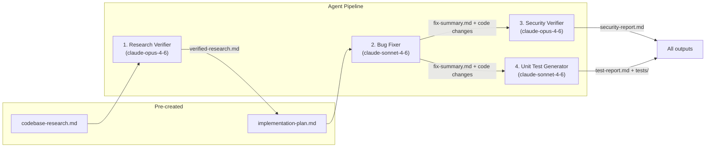

# Homework 4: 4-Agent Pipeline

> **Student Name**: Artem Chumachenko
> **Date Submitted**: 2026-05-22
> **AI Tools Used**: Claude Code (Claude Opus 4.6, Claude Sonnet 4.6)

---

## Project Overview

A **4-agent Claude Code pipeline** that operates on a small Python **Expense Tracker API**, automatically finding bugs, fixing them, reviewing for security vulnerabilities, and generating unit tests.

The pipeline demonstrates multi-agent orchestration: each agent has a specific role, an explicitly chosen model, and produces structured output files. A single shell command (`./run-pipeline.sh`) chains all four agents across three seeded bugs.

---

## Architecture

### Pipeline Flow



### Mini Application

**Expense Tracker API** (Python 3.9 + FastAPI) with 5 endpoints:

| Method | Endpoint | Description |
|--------|----------|-------------|
| `POST` | `/expenses` | Create an expense |
| `GET` | `/expenses` | List expenses (date/category filter) |
| `GET` | `/expenses/{id}` | Get by ID |
| `GET` | `/summary` | Spending summary |
| `DELETE` | `/expenses/{id}` | Delete expense |

---

## Agents and Model Choices

| Agent | Model | Justification |
|-------|-------|---------------|
| **Research Verifier** | `claude-opus-4-6` | Verifying file:line references and code snippets against source requires strong reasoning and attention to detail |
| **Bug Fixer** | `claude-sonnet-4-6` | Applying pre-planned code changes and running tests is a structured task that benefits from speed over deep reasoning |
| **Security Verifier** | `claude-opus-4-6` | Security analysis requires deep reasoning to identify subtle vulnerabilities (injection, timing attacks, auth bypasses) |
| **Unit Test Generator** | `claude-sonnet-4-6` | Generating FIRST-compliant tests from a fix summary is a well-scoped task where speed matters more than deep analysis |

Each agent definition is in `agents/*.agent.md` with YAML frontmatter specifying `model`, `role`, `inputs`, `outputs`, and `skills`.

---

## Skills

| Skill | File | Used by |
|-------|------|---------|
| Research Quality Measurement | `skills/research-quality-measurement.md` | Research Verifier |
| FIRST Unit Test Principles | `skills/unit-tests-FIRST.md` | Unit Test Generator |

---

## Bugs Found and Fixed

| Bug | File | Before | After | Severity |
|-----|------|--------|-------|----------|
| Off-by-one date filter | `src/utils.py:18` | `e.date < end` | `e.date <= end` | Medium |
| Incorrect average | `src/utils.py:38` | `total / len(by_category)` | `total / len(expenses)` | Medium |
| Missing delete validation | `src/main.py:64-68` | Always returns 200 | Returns 404 for missing ID | Low |

All three bugs existed in the original code and were found/fixed by the pipeline agents.

---

## Security Findings

The Security Verifier agent identified these issues across the codebase (consistent across all 3 bug reports):

| ID | Finding | Severity | File:Line |
|----|---------|----------|-----------|
| SEC-001 | Hardcoded API secret `"supersecret123"` | HIGH | `src/main.py:15` |
| SEC-002 | Auth function defined but never used as dependency | HIGH | `src/main.py:20-22` |
| SEC-003 | Log injection via unsanitized description | MEDIUM | `src/main.py:29` |
| SEC-004 | Timing-unsafe `!=` comparison for secrets | MEDIUM | `src/main.py:21` |
| SEC-005 | Unpinned dependency versions | LOW | `requirements.txt` |
| SEC-006 | Stale bug comments in fixed code | INFO | `src/utils.py:17,37` |

SEC-001 and SEC-003 are the two intentionally seeded security issues per the assignment specification.

---

## Test Results

- **22 tests** across 4 test files (11 baseline + 11 agent-generated)
- **22/22 pass**
- **98% code coverage** (up from 91% baseline)
- Only uncovered: `src/main.py:21-22` (the `verify_api_key` body, which is itself a security finding — defined but never used)

---

## Generated Artifacts

### Per-bug outputs (21 files total)

Each bug directory in `context/bugs/` contains 7 files:

| File | Creator | Purpose |
|------|---------|---------|
| `bug-context.md` | Manual | Documents the seeded bug |
| `research/codebase-research.md` | Manual | Research with file:line references |
| `research/verified-research.md` | Agent 1 | Verification report with quality rating |
| `implementation-plan.md` | Manual | Exact before/after code changes |
| `fix-summary.md` | Agent 2 | Applied changes + test results |
| `security-report.md` | Agent 3 | OWASP-categorized vulnerability scan |
| `test-report.md` | Agent 4 | FIRST-compliant test results |

### Screenshot-ready artifacts

| File | Content |
|------|---------|
| `artifacts/pipeline-execution-output.txt` | Full pipeline run transcript |
| `artifacts/pytest-results-output.txt` | pytest + coverage output |
| `artifacts/security-findings-summary.txt` | Consolidated security findings |
| `artifacts/pipeline-logs/` | Timestamped per-bug agent logs |

---

## Pipeline Execution

### Single-command run

```bash
cd homework-4
./run-pipeline.sh          # all 3 bugs
./run-pipeline.sh 001      # single bug
```

### How the pipeline works

The script:
1. Discovers the `claude` binary via `$CLAUDE_CODE_EXECPATH` or `which claude`
2. Parses each `.agent.md` frontmatter for the model name
3. Extracts the agent body as system prompt
4. Invokes `claude -p --model <model> --append-system-prompt "<body>" "<task>"`
5. Runs all 4 agents in sequence per bug, stopping on failure

### Execution notes

- **Bugs 001 and 002** ran fully through the automated pipeline (`./run-pipeline.sh`)
- **Bug 003** ran the Research Verifier via the pipeline; the remaining three agents (Bug Fixer, Security Verifier, Unit Test Generator) were executed using the documented direct-agent fallback after an API credit-limit error. The same Claude models and identical agent instructions were used. This is the fallback path described in `run-pipeline.sh` and `docs/claude_cli_analysis.md`.

---

## How to Run

See [HOWTORUN.md](HOWTORUN.md) for detailed setup and execution instructions.

Quick start:

```bash
cd homework-4
python3 -m venv venv && source venv/bin/activate
pip install -r requirements.txt
python -m pytest tests/ -v                # 22 tests pass
python -m uvicorn src.main:app --reload   # start API on :8000
./run-pipeline.sh                         # run pipeline
```

---

*This project was completed as part of the AI-Assisted Development course.*
